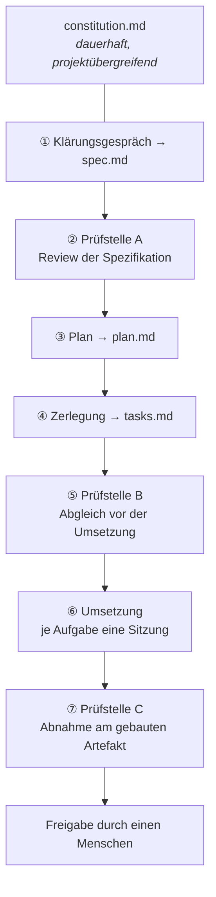

# Spec-Driven Development

*Handreichung für Studium und Praxis · Stand September 2026*

> **Worum es geht.**
>
> Diese Handreichung erklärt, wie man Software mit KI-Agenten so entwickelt, dass das Ergebnis überprüfbar ist. Sie beschreibt zuerst die Modellvorstellung, die man dafür braucht — ohne sie bleibt jedes Verfahren Zeremonie. Danach die Artefakte: welche Dokumente entstehen, was in welches gehört, wie Akzeptanzkriterien aussehen, die eine Maschine nicht missverstehen kann. Danach den Ablauf mit seinen Prüfstellen und Prüfmitteln. Und zuletzt, was diese Mittel *nicht* leisten, samt Wegen, auf denen du weitergraben kannst.
>
> **Zur Haltbarkeit.** Das Feld bewegt sich schnell. Werkzeugnamen, Befehlssyntax und Zahlenangaben in diesem Text sind Momentaufnahmen und werden altern; die Denkfiguren dahinter — Regelkreis, exogenes Maß, Verfälschungsprobe — sind älter als die aktuelle Werkzeuggeneration und werden sie überdauern. Wo du eine Werkzeugangabe brauchst, prüfe sie nach. Wo du eine Denkfigur brauchst, arbeite mit ihr.

---

# Teil I — Die Modellvorstellung

## 1. Worum es geht

Spec-Driven Development stellt eine geschriebene, versionierte Spezifikation an den Anfang: erst wird festgehalten, *was* ein System leisten soll und woran man das erkennt, dann entsteht daraus der Plan, dann die Aufgaben, dann der Code. Der menschliche Aufwand verschiebt sich von der Implementierung zur Beschreibung — dorthin, wo Fehler am billigsten zu beheben sind.

Die Herkunft ist schnell erzählt. Anfang 2025 prägte Andrej Karpathy den Begriff *Vibe Coding* für das lose Prompten und Übernehmen von Code, den man nicht mehr vollständig liest. Für Wegwerf-Skripte ist das ein legitimes, oft sehr produktives Vorgehen; für alles, was gewartet werden muss, nicht. Im September 2025 veröffentlichte GitHub mit *Spec Kit* das erste breit beachtete Toolkit, das den Gegenentwurf in einen Ablauf goss. Seither ist SDD weniger ein Produkt als eine Disziplin — und in der Sache eine Rückkehr zu Verfahren, die es längst gab: Contract-First-Design, Design by Contract, Behaviour-Driven Development, Architecture Decision Records. Neu ist allein der Anlass: Erst leistungsfähige Coding-Agenten machen es praktikabel, aus einer präzisen Beschreibung unmittelbar lauffähigen Code zu erzeugen.

Damit ist die Historie erledigt. Der Rest dieses Teils behandelt das, was tatsächlich schwierig ist: die Vorstellung davon, *was* da eigentlich arbeitet, wenn ein Agent Code schreibt — und warum ein sorgfältig aufgesetzter Prozess allein nicht genügt.

> **Merksatz — die Kernaussage in einem Satz.**
> Die Qualität agentisch erzeugter Software hängt weniger vom Modell ab als davon, ob es ein Abnahmesignal gibt, das die umsetzende Instanz nicht selbst erzeugt hat.

## 2. Agent = Modell + Harness

Der erste mentale Umbau: Ein Coding-Agent ist nicht ein Sprachmodell. Er ist ein Sprachmodell *plus alles andere* — und dieses andere hat einen Namen: **Harness**. Dazu gehören die Ausführungsschleife, die verfügbaren Werkzeuge, die Sandbox, in der gearbeitet wird, das Gedächtnis über Sitzungsgrenzen hinweg und die Regeln darüber, was überhaupt in den Kontext gelangt.

Das ist keine Begriffsklauberei, sondern hat messbare Folgen. Veröffentlichte Vergleiche zeigen, dass die Streuung zwischen verschiedenen Harnesses die Streuung zwischen verschiedenen Modellen übertreffen kann: dasselbe Modell erreicht in zwei Umgebungen deutlich unterschiedliche Erfolgsquoten, in berichteten Fällen 46 % gegenüber 80 %, oder 42 % gegenüber 78 %.[^harness] Ein Anbieter berichtet von einer Steigerung, die allein daraus entstand, dass 80 % der angebotenen Werkzeuge *entfernt* wurden — weniger Auswahl, klarere Entscheidungen.

> **Vorsicht mit diesen Zahlen.** Sie stammen aus Hersteller- und Praxisberichten, nicht aus unabhängiger Replikation. Die Größenordnung ist über mehrere Quellen konsistent, die Einzelwerte sind es nicht notwendig. Belastbar ist die Richtung, nicht die Größe. Diese Einschränkung gilt für fast alle quantitativen Angaben in diesem Feld — gewöhne dir an, danach zu fragen, wer eine Zahl erhoben hat und mit welchem Interesse.

Die praktische Folgerung ist unbequem, weil sie dem Reflex widerspricht: Wer Qualitätsprobleme durch einen Modellwechsel lösen will, verschiebt sie meistens nur. Die erste Investition gehört in die Umgebung — und dort speziell in den Teil, der zurückmeldet, was tatsächlich entstanden ist.

## 3. Vorsteuerung und Rückmeldung

Der zweite mentale Umbau: Denke nicht in einer Befehlskette, sondern in einem **Regelkreis** mit zwei Richtungen.[^boeckeler]

**Vorsteuerung** wirkt vorwärts. Anweisungen, Konventionen, Verfassungen, Spezifikationen, Pläne — alles, was vor der Arbeit festgelegt wird, um die Wahrscheinlichkeit zu erhöhen, dass etwas Richtiges entsteht. Vorsteuerung ist billig, angenehm zu schreiben und fühlt sich nach Kontrolle an.

**Rückmeldung** wirkt rückwärts. Testläufe, Prüfbefehle, Linter, Typprüfer, Bedienläufe an der laufenden Anwendung, Reviews durch eine getrennte Instanz — alles, was am Ergebnis misst, was tatsächlich entstanden ist. Rückmeldung ist teurer einzurichten und unangenehmer zu lesen.


Beide Richtungen gibt es in zwei Ausprägungen: **rechnerisch** (ein Werkzeug läuft und liefert ein eindeutiges Ergebnis) und **inferentiell** (eine Instanz urteilt). Ein Testlauf ist rechnerisch, ein Review ist inferentiell. Sie ersetzen einander nicht.

Nach Schwierigkeit sortiert lassen sich drei Bereiche unterscheiden, in denen dieser Regelkreis wirken soll:

1. **Wartbarkeit** — Komplexität, Duplizierung, Stil. Gut in den Griff zu bekommen, weil rechnerische Sensoren dafür existieren und ausgereift sind.
2. **Architekturkonformität** — Struktur, Beobachtbarkeit, Leistungseigenschaften. Beherrschbar über Fitnessfunktionen, also automatisierte Prüfungen gegen Architekturvorgaben.
3. **Verhalten** — ob die Software fachlich das Richtige tut. Das ist der Elefant im Raum: Verhaltensprüfung stützt sich überwiegend auf Tests, die der Agent selbst geschrieben hat, und ein Agent, der die Anforderung missversteht, erzeugt Tests, die sein Missverständnis bestätigen.

> **Merksatz.** Ein Vorgehen, das nur vorsteuert, erzeugt keine zufälligen Fehler — es erzeugt **gut begründete** Fehler. Die sind schwerer zu finden, weil alles daran ordentlich aussieht.

Der dritte Punkt ist nicht ein Randproblem, sondern der offene Punkt des ganzen Feldes. Die nächsten beiden Abschnitte behandeln ihn.

## 4. Warum „grün" nicht „richtig" heißt

Stell dir den typischen Ablauf vor: Eine Instanz liest die Spezifikation, bildet sich daraus eine Lesart, schreibt aus dieser Lesart den Code — **und aus derselben Lesart die Tests**. Alle drei Artefakte stammen aus einer einzigen Interpretation. Ist die Interpretation falsch, bestätigen die Tests genau diesen Fehler. Der grüne Testlauf belegt dann Widerspruchsfreiheit, nicht Richtigkeit.

Das nennt man **endogene Verifikation**: Das Maß stammt von dem, der daran gemessen wird. Der zugehörige Fachbegriff ist älter als die Sache — das **Orakelproblem** bezeichnet die Schwierigkeit, für eine gegebene Eingabe die richtige Ausgabe überhaupt zu bestimmen. Wer sie nicht kennt, kann keinen Erwartungswert hinschreiben. Ein Modell, das trotzdem einen hinschreiben muss, nimmt den, den seine eigene Umsetzung liefert.

Untersuchungen zu maschinell erzeugten Testzusicherungen zeigen genau dieses Muster: Sie bilden eher das **tatsächliche** als das **beabsichtigte** Verhalten ab, wodurch Fehler als Sollverhalten festgeschrieben werden.[^orakel] Und hohe Testüberdeckung sagt darüber wenig aus — sie misst, welcher Code ausgeführt wurde, nicht, welches Verhalten geprüft wurde.

Die zweite, davon unabhängige Lücke: **fehlende Ausführung**. Tests entstehen, aber sie laufen nie gegen ein wirklich gestartetes Artefakt in vollständiger Umgebung — oder nur so weit, wie es ohne Bedienung der Oberfläche geht. Alles, was sich erst im Betrieb zeigt (leere Zustände, Ladezustände, Fehlermeldungen, Grenzwerte, ungültige Eingaben), sammelt sich unbemerkt bis zur Abnahme an.

Beide Lücken zusammen erzeugen einen charakteristischen Zustand, den du wiedererkennen können solltest: **hoher Nachweisaufwand bei niedriger Nachweiskraft**. Es liegen Testdateien vor, es liegen Berichte vor, es liegen grüne Läufe vor — und die erste echte Benutzung fördert schwere Mängel zutage, die keiner davon angezeigt hat.

Ein naheliegender Gegenzug reicht nicht aus. Gibt man dem Agenten ein Prüfsignal vor, erfüllt er es — notfalls auf dem kürzesten Weg, über einen Nebenpfad, während der eigentlich verlangte Gegenstand unfertig bleibt. Das Phänomen heißt *building to the test*.[^btt]

> **Merksatz — die wichtigste Einschränkung dieses ganzen Textes.**
> Ein Prüfsignal einzuführen genügt nicht. Es muss **exogen** sein — die umsetzende Instanz darf es weder schreiben noch verbiegen können — und es muss **durch den Auslieferungspfad führen**.

## 5. Die drei Reifegrade

Der dritte mentale Umbau, und der, an dem die meisten Darstellungen zu weit gehen. Man liest häufig: *Die Spezifikation ist die Source of Truth, Code ist ein nachgelagertes Artefakt.* Als Zielbild ist das anregend. Als Aussage über den heutigen Stand ist es falsch, und wer es glaubt, baut sich ein falsches Sicherheitsgefühl.

Die Praxis unterscheidet drei Stufen der Strenge:[^piskala]

| Stufe | Was gilt | Wofür geeignet |
| --- | --- | --- |
| **Spec-first** | Die Spec stößt die Erzeugung an, danach darf der Code eigene Wege gehen | Prototypen, einzelne Features, geringer Aufwand, keine langfristige Zusage |
| **Spec-anchored** | Spec und Code entwickeln sich gemeinsam weiter; Tests erzwingen die Übereinstimmung | Der Regelfall für Systeme, die betrieben werden |
| **Spec-as-source** | Nur die Spec wird von Hand bearbeitet, der Code wird vollständig erzeugt und nie angefasst | Beseitigt das Auseinanderlaufen konstruktiv — setzt aber Erzeugungswerkzeuge voraus, denen man das zutraut |

Die mittlere Stufe gilt als der brauchbare Punkt für die meisten Produktivsysteme; die dritte ist überwiegend Zielvorstellung. Auch Thoughtworks betont, dass **ausführbarer Code die wartungspflichtige Quelle bleibt**, und widerspricht der Lesart, Spezifikationen allein genügten; im Technology Radar stehen SDD-Werkzeuge im Ring „Assess" — erkunden, nicht flächig einführen.[^radar]

Zwei Begriffe gehören dazu:

- **Spec-Drift** — Spezifikation und Code laufen auseinander, weil am Dokument vorbei gearbeitet wurde. Das passiert nicht durch Böswilligkeit, sondern durch den formlosen Zuruf: „mach das noch schnell anders".
- **Round-Tripping** — die Idee, Code jederzeit verlustfrei aus der Spec neu zu erzeugen. Funktioniert heute nicht zuverlässig.

> **Merksatz.** Die Spec ist das **verbindliche Maß**, nicht der Ersatz für den Quelltext. Sie sagt, woran gemessen wird. Sie erzeugt den Code nicht auf Knopfdruck neu, und sie enthebt niemanden davon, Diffs zu lesen.

Praktisch heißt das: Ziel ist *spec-anchored*. Neue Wünsche und gefundene Fehler wandern zuerst in die Spezifikation und erst danach in den Code — das ist Disziplin, die ein Team aktiv aufrechterhält, kein Automatismus, der von selbst greift.

## 6. Wann sich das lohnt — und wann nicht

Diese Verfahren verschieben Aufwand nach vorn. Sie machen den Anfang teurer und das Ende billiger. Ob sich das rechnet, hängt an Lebensdauer, Kritikalität und der Zahl der beteiligten Instanzen.

**Lohnt sich**, wenn Code über längere Zeit gewartet wird, mehrere Personen daran arbeiten, das System stark integriert oder reguliert ist, die Anforderungen komplex sind — und immer dann, wenn ein erheblicher Teil des Codes von Agenten stammt.

**Lohnt sich nicht** bei Wegwerf-Prototypen, kurzen Einzelprojekten und explorativer Arbeit, in der die Anforderung selbst noch gesucht wird. Dort ist der lose Umgang das richtige Werkzeug; die Kunst liegt darin, bewusst zu wählen statt aus Gewohnheit.

Zwei Fehlerbilder aus der Praxis solltest du kennen, bevor du anfängst:

- **Überspezifikation.** Wird die Spec zu Pseudocode, hast du das Programm zweimal geschrieben. Die Spec beschreibt Fachlichkeit, nicht Implementierung.
- **Zeremonie ohne Ertrag.** Ein Verfahren, das Belege erzeugt, die geprüft *aussehen*, kann die Fehlerklasse aus Abschnitt 4 sogar verdecken. Jedes Element in deinem Vorgehen muss beantworten können, welchen Fehler es fängt. Kann es das nicht, streiche es.

Und eine Beobachtung, die man ernst nehmen sollte: Am meisten Nutzen ziehen erfahrene Entwickler:innen mit soliden Architektur- und Handwerksgewohnheiten aus diesen Abläufen. Das Verfahren ersetzt Urteilsvermögen nicht — es lenkt es auf die Stellen, an denen es zählt.

---

# Teil II — Die Artefakte

## 7. Vier Dateien, vier Fragen

Ein SDD-Projekt trägt vier Dokumente. Jedes beantwortet genau eine Frage — und keines beantwortet die Frage eines anderen mit.

| Datei | beantwortet | wer sie schreibt | Lebensdauer |
| --- | --- | --- | --- |
| `constitution.md` | Wie wird gearbeitet? | du, einmalig, projektübergreifend | dauerhaft |
| `spec.md` | Was wird gebaut und warum? | im Klärungsgespräch erarbeitet, von dir bestätigt | dauerhaft |
| `plan.md` | Womit wird es gebaut? | abgeleitet aus der Spezifikation | flüchtig |
| `tasks.md` | In welcher Reihenfolge? | abgeleitet aus dem Plan | flüchtig |

Die Reihenfolge der Zeilen ist zugleich die **Vorrangregel**: Widersprechen sich zwei Dateien, gilt die weiter oben stehende. Ohne eine solche Regel entscheidet die Instanz selbst, welcher Quelle sie folgt — in jeder Sitzung neu und ohne dass du es bemerkst. Nur vorliegende Dateien zählen: eine Datei, die es noch nicht gibt, ist kein Mangel, sondern in der Regel das Ergebnis des laufenden Arbeitsschritts.

**Dauerhaft und flüchtig sind keine Wertung, sondern eine Aussage über Bindung.** Verfassung und Spezifikation überleben den Code — sie beschreiben, wie gearbeitet wird und was gelten soll. Plan und Aufgabenliste sind an eine konkrete Umsetzung gebunden; wird die verworfen, gehen sie mit.

Von dieser Trennung gibt es eine wichtige Ausnahme, und sie ist es wert, verstanden zu werden: **Die Abschnitte des Plans, die das Abnahmesignal tragen — die Prüfbefehle und die Nachweistabelle —, werden beim Verwerfen des Plans archiviert und der Spezifikation beigelegt.** Sonst lässt sich bei der nächsten Änderung nicht mehr feststellen, woran ein Kriterium ursprünglich gemessen wurde, und das Maß muss neu erfunden werden — meistens von genau der Instanz, die den Code schreibt. Genau das soll das Verfahren verhindern.

### Die Verfassung

Die `constitution.md` steht über allen Projekten. Sie ist aus nichts abgeleitet, und sie wird im laufenden Auftrag nicht geändert; Änderungswünsche sind ein eigener Vorgang. Der Prüfstein für jeden Satz darin: **Lässt er sich nicht unverändert in ein beliebiges anderes Projekt kopieren, gehört er nicht hinein.**

Sinnvolle Regelungsgegenstände sind Vorrang bei Widersprüchen, der Umgang mit Annahmen und Rückfragen, Einfachheit als Voreinstellung, die Beschränkung auf chirurgische Änderungen, das Verhältnis von Verifikation und Fertigmeldung samt Bewertungsschema, das Verbot unbelegter Behauptungen über fremde Bibliotheken, Sprach- und Datenkonventionen, sowie die Grenzen dessen, was ohne Aufforderung angefasst werden darf.

Ein Punkt daraus verdient besondere Aufmerksamkeit, weil er häufig zu kurz gefasst wird: **Existenz und Signatur einer Funktion sind kein Beleg für ihr Verhalten.** Dass eine Bibliotheksfunktion existiert und die erwarteten Parameter nimmt, sagt nichts darüber, was sie zurückgibt. Annahmen über Verhalten werden gegen die installierte Version *ausgeführt* und das Ergebnis dokumentiert — nicht geglaubt.

## 8. Die Trennlinie zwischen Spec und Plan

Das ist die wichtigste Einzelregel des ganzen Verfahrens.

**Die Spezifikation sagt was und warum, in Fachsprache.** Kein Technikstack, keine Bibliotheken, keine Versionen, keine Datenformate, kein Code. **Der Plan sagt wie.** Steht Technik in der Spec, ist das ein Mangel und keine Vorgabe.

Der Grund ist nicht Ordnungsliebe. Er ist doppelt:

- **Enthält die Spezifikation Code, hast du das Programm zweimal geschrieben** — einmal in Prosa, einmal richtig. Der zweite Durchgang macht den ersten wertlos, und gepflegt wird am Ende keiner von beiden.
- **Die Spezifikation ist dauerhaft, die Technikwahl ist es nicht.** Eine Spec, die eine bestimmte Bibliothek nennt, verfällt mit dieser Bibliothek. Eine Spec, die Fachlichkeit beschreibt, überlebt drei Technologiewechsel.

Die Grenze ist im Zweifel leicht zu ziehen: Frage, ob eine Festlegung auch dann noch gälte, wenn das Produkt in einer völlig anderen Technologie gebaut würde. Lautet die Antwort ja, gehört sie in die Spec.

> **Ein Grenzfall, der oft falsch entschieden wird.** „Das System meldet Abweichungen vom gelernten Normalverhalten und sagt keine Restlebensdauer voraus" ist eine fachliche Festlegung und gehört in die Spec — sie bestimmt, was das Produkt *aussagt*. „Wir verwenden einen Isolation Forest" ist eine Technikwahl und gehört in den Plan.

## 9. Akzeptanzkriterien in EARS

Ein Akzeptanzkriterium ist die Bedingung, an der sich die Erfüllung einer Anforderung feststellen lässt. In freier Prosa geschrieben, ist es mehrdeutig — und Mehrdeutigkeit wird von einer umsetzenden Instanz zuverlässig zu ihren Gunsten aufgelöst.

**EARS** (*Easy Approach to Requirements Syntax*) ist die verbreitete Antwort darauf. Alistair Mavin und Kollegen entwickelten die Notation bei Rolls-Royce, während sie die Lufttüchtigkeitsvorschriften für eine Triebwerkssteuerung auswerteten; veröffentlicht wurde sie 2009 auf der IEEE-Requirements-Engineering-Konferenz.[^ears] Sie wird unter anderem bei Airbus, Bosch, Intel, NASA und Siemens eingesetzt und ist seit 2025 in mehrere SDD-Werkzeuge eingezogen. EARS schränkt natürliche Sprache nur sanft ein: eine feste Klauselreihenfolge und eine Handvoll Schlüsselwörter.

| Muster | Vorlage | Beispiel |
| --- | --- | --- |
| **ubiquitär** | THE system SHALL … | THE system SHALL jeden verworfenen Messwert protokollieren. |
| **ereignisgetrieben** | WHEN … THE system SHALL … | WHEN ein Messwert außerhalb der Plausibilitätsgrenzen eintrifft, THE system SHALL ihn verwerfen und als Sensorfehler kennzeichnen. |
| **zustandsgetrieben** | WHILE … THE system SHALL … | WHILE das Normalverhalten noch nicht gelernt ist, THE system SHALL keine Warnung erzeugen. |
| **unerwünschtes Verhalten** | IF … THEN … | IF länger als 30 Sekunden kein gültiger Messwert eintrifft, THEN THE system SHALL den Zustand als veraltet kennzeichnen. |
| **optional** | WHERE … THE system SHALL … | WHERE mehrere Maschinen angebunden sind, THE system SHALL sie getrennt ausweisen. |

Die Schlüsselwörter bleiben englisch, der Satzkörper ist deutsch. Das sieht zunächst merkwürdig aus, hat aber einen praktischen Grund: Die Schlüsselwörter sind das Erkennungsmerkmal des Musters, und sie sollen sich nicht mit gewöhnlichem Text vermischen.

Der eigentliche Gewinn liegt darin, dass jedes Muster seine Prüfform mitbringt: Ein ubiquitäres Kriterium wird zu einer Invariante, ein ereignisgetriebenes zu einem Testfall mit Auslöser, ein zustandsgetriebenes zu einer Zustandsmaschine, ein unerwünschtes zu einem Fehlerpfad. Die Kriterien lassen sich fast eins zu eins in Testfälle übersetzen — und genau das macht eine Spezifikation prüfbar statt nur beratend.

Drei Regeln, die unabhängig vom Muster gelten:

- **Jedes Kriterium beschreibt beobachtbares Verhalten des laufenden Produkts**, nie einen Zustand des Quellcodes. Ein erfolgreicher Bauvorgang ist kein Akzeptanzkriterium.
- **Mindestens ein Kriterium betrifft den Aufruf des ausgelieferten Artefakts** in seiner Zielumgebung. Ohne dieses Kriterium bleibt der häufigste Auslieferungsfehler ungeprüft: Es baut, aber es lädt nicht.
- **Ein Kriterium, das sich nicht in einen Testfall übersetzen lässt, ist noch nicht fertig formuliert.** Bleibt es dabei, halte ausdrücklich fest, dass es nur von Hand prüfbar ist — dann darf es später nur als „umgesetzt, aber nicht nachgewiesen" gelten, nicht als erledigt.

## 10. Invarianten statt Sollwerten

Hier liegt der Kern der Sache, und hier lohnt sich Zeit.

**Das Problem.** Ein Beispieltest braucht einen Erwartungswert. Wo rechnet, umgeformt oder aufgelöst wird, kennt diesen Wert häufig niemand — und dann erfindet ihn die umsetzende Instanz, aus ihrer eigenen Umsetzung heraus. So entstehen Tests, die eine falsche Berechnung als richtig festschreiben. Der Testlauf ist grün, das Ergebnis ist falsch, und beides ist konsistent.

**Der Ausweg.** Eine **Invariante** beschreibt nicht, *was* herauskommt, sondern *wie sich das Ergebnis ändern muss*, wenn sich die Eingabe auf bestimmte Weise ändert. Sie ist ohne Kenntnis des richtigen Ergebnisses formulierbar, sie gilt über einen ganzen Eingabebereich, und sie lässt sich nicht nachträglich an eine Ausgabe anpassen.

Der Fachbegriff dafür ist **metamorphes Testen**: Metamorphe Relationen sind notwendige Eigenschaften der beabsichtigten Funktionalität, die über mehrere Programmläufe geprüft werden. Das Verfahren gilt seit langem als Standardantwort auf das Orakelproblem — namentlich für wissenschaftliche Rechenanwendungen, Simulatoren, Compiler, Signalverarbeitung und maschinelles Lernen.[^metamorph] Praktisch eng verwandt ist das **eigenschaftsbasierte Testen**, bei dem ein Werkzeug viele Eingaben erzeugt und prüft, ob eine behauptete Eigenschaft für alle gilt.

**Die Familien**, nach denen du fragen kannst:

| Familie | Leitfrage |
| --- | --- |
| Skalierung | Was passiert mit dem Ergebnis, wenn eine Eingabegröße verdoppelt wird? |
| Symmetrie und Vertauschung | Welche Reihenfolge oder welches Vorzeichen darf das Ergebnis nicht ändern? |
| Umkehrung und Rückeinsetzung | Lässt sich das Ergebnis in die Ausgangsbeziehung zurücksetzen — und was muss dabei herauskommen? |
| Einheiten und Dimensionen | Welche Kombination von Eingaben ist fachlich unzulässig, und woran erkennt man das am Ergebnis? |
| Monotonie und Grenzverhalten | In welche Richtung muss sich das Ergebnis bewegen, wenn eine Eingabe wächst? Was gilt an den Rändern? |
| Erhaltung | Welche Größe muss über eine Umformung hinweg gleich bleiben? |

**Ein durchgerechnetes Beispiel.** Ein Produkt löst physikalische Formeln nach einer gesuchten Größe auf. Den richtigen Zahlenwert für eine beliebige Eingabe kennt niemand vorab — das Orakelproblem in Reinform. Trotzdem lässt sich das Verhalten vollständig einschnüren:

> THE system SHALL für jede Auflösung gelten lassen, dass das Rückeinsetzen des Ergebnisses in die Ausgangsgleichung diese innerhalb einer relativen Abweichung von 10⁻⁹ erfüllt.
> WHEN in F = m · a die Masse verdoppelt wird und die Beschleunigung unverändert bleibt, THE system SHALL eine Kraft liefern, die sich um denselben Faktor ändert.
> IF eine Kombination von Eingaben dimensionsmäßig unzulässig ist, THEN THE system SHALL keine Zahl ausgeben, sondern die Unzulässigkeit benennen.
> IF eine Größe, durch die geteilt werden müsste, den Wert null annimmt, THEN THE system SHALL den Fall benennen und keinen Zahlenwert ausgeben.

Keine dieser Aussagen setzt voraus, dass jemand das Ergebnis kennt. Alle vier sind maschinell über einen ganzen Eingabebereich prüfbar. Und alle vier sind das, was ein Sollwert nie ist: **von der Umsetzung nicht formbar**.

**Die Verletzbarkeitsprobe.** Zu jeder Invariante gehört die Frage: *Welche plausible Falschumsetzung würde sie brechen?* Kannst du keine nennen, ist die Relation keine Invariante, sondern eine Beschreibung — streiche sie. Ohne diese Regel entstehen Sätze wie „das Ergebnis ist korrekt", die jede Implementierung erfüllt und deshalb nichts messen. Die Rückeinsetzungs-Invariante oben bricht bei jedem vertauschten Operanden; die Skalierungs-Invariante bricht bei einem falschen Faktor; die Dimensionsregel bricht, sobald Einheiten ignoriert werden.

**Zwei Angaben, die dazugehören.** Eine **Toleranz** — wo numerisch gerechnet wird, ist eine Invariante ohne zulässige Abweichung nicht prüfbar. Und ein **Gültigkeitsbereich** — für welche Eingaben gilt sie, für welche ausdrücklich nicht.

> **Grenzen, ehrlich benannt.** Invarianten sind fachliche Aussagen und müssen von jemandem stammen, der das Fach beherrscht. Ein Modell kann sie gut *vorschlagen*; bestätigen muss sie ein Mensch. **Eine unbestätigte Invariante ist gefährlicher als keine**, weil sie wie ein Maß aussieht. Und sie ersetzen keine Sollwerte, wo Sollwerte bekannt sind — sie ergänzen sie dort, wo keine bekannt sind.

Invarianten sind fachliche Aussagen. Sie gehören deshalb in die Spezifikation, nicht in den Plan. **Dass** sie gelten, entscheidest du; **wie** sie geprüft werden, entscheidet der Plan.

## 11. Zustände sind Anforderungen

Für jede interaktive Funktion entstehen Kriterien für fünf Zustände:

| Zustand | Frage |
| --- | --- |
| **leer** | Was zeigt das Produkt, bevor etwas eingegeben oder ausgewählt wurde? |
| **lädt** | Was geschieht, während etwas dauert? Woran erkennen Nutzende, dass gearbeitet wird? |
| **Fehler** | Was geschieht, wenn ein Vorgang scheitert? Was steht dann auf dem Bildschirm? |
| **Grenzwert** | Was geschieht am Rand des zulässigen Bereichs — leere Auswahl, ein einziges Element, sehr viele, sehr lange Eingaben? |
| **ungültige Eingabe** | Was geschieht bei einer nicht verarbeitbaren Eingabe, und wie kommen Nutzende in den gültigen Zustand zurück? |

Das ist der häufigste Ort für Mängel, die kein Test bemerkt und jede Nutzerin sofort sieht. Der Grund ist strukturell: Prüfmittel, die nur den Quellstand betrachten, erreichen diese Zustände prinzipiell nicht, und sie treten im Normalbetrieb selten von allein auf.

Entscheidend ist deshalb: **Was hier nicht als Kriterium steht, wird weder gebaut noch geprüft.** Die Beurteilung landet dann als Geschmacksfrage in der Abnahme — oder gar nicht.

Nicht jede Funktion braucht alle fünf. Trifft ein Zustand nicht zu, schreibe das ausdrücklich hin. „Entfällt, weil …" ist eine Festlegung; Schweigen ist eine Lücke.

## 12. Ein Beispiel

Der folgende Auszug zeigt, wie die drei Kriteriengruppen zusammenwirken. Beispiel ist ein Prototyp zur Zustandsüberwachung einer Produktionsmaschine: Sensoren liefern laufend Messwerte, das Produkt bewertet daraus den Zustand, eine Meisterin sieht das Ergebnis auf einer einfachen Oberfläche. Der Auszug ist gekürzt; die vollständige Spezifikation umfasst höchstens drei Seiten Fließtext zuzüglich Kriterientabelle und Rückverfolgung.

Beachte, was hier **nicht** steht: keine Programmiersprache, keine Bibliothek, kein Datenbankformat, kein Endpunktname. Das gehört alles in den Plan.

```markdown
## 1. Zweck
Nachweis, dass sich aus Sensordaten ein brauchbares Frühwarnsignal für
Wartungsbedarf ableiten lässt. Prototyp, kein Dauerbetrieb. Diese
Spezifikation ist zugleich Bauplan und Übergabedokument an das Team,
das die produktive Fassung baut.

## 2. Nutzer:innen
Eine Industriemeisterin, die den Zustand ohne Schulung deuten können
muss. Keine Data Scientists.

## 3. Fachlicher Inhalt und Umfang
Das Produkt lernt das Normalverhalten aus einer störungsfreien
Referenzphase und meldet Abweichungen davon. Es sagt keine
Restlebensdauer voraus — im Prototyp liegen keine echten Ausfälle als
Lerngrundlage vor.
Messwerte außerhalb festgelegter Plausibilitätsgrenzen gelten als
Sensorfehler, nicht als Maschinenfehler. Diese Unterscheidung
entscheidet über die Vertrauenswürdigkeit des ganzen Produkts.

## 4. Nicht-Ziele
Mehrmaschinenbetrieb · Alarmierung über Fremdsysteme · Rollen und
Rechte · Überwachung des Lernmodells im Betrieb.

## 5. Akzeptanzkriterien

### 5.1 Verhalten
V1  WHILE ausschließlich Messwerte innerhalb des Referenzverhaltens
    eintreffen, THE system SHALL den Zustand unverändert als
    unauffällig ausweisen.
V2  WHEN eine Messgröße den Referenzbereich fortlaufend verlässt,
    THE system SHALL den Zustand binnen 15 Sekunden auf eine höhere
    Warnstufe heben.
V3  IF länger als 30 Sekunden kein gültiger Messwert eintrifft,
    THEN THE system SHALL den angezeigten Zustand als veraltet
    kennzeichnen und den letzten bekannten Wert mit seinem Zeitpunkt
    zeigen — nicht als unauffällig gelten lassen.
V4  THE system SHALL im ausgelieferten Zustand aufrufbar sein und
    ohne weitere Eingaben den aktuellen Maschinenzustand anzeigen.

### 5.2 Invarianten
I1  THE system SHALL Messwerte, die als Sensorfehler verworfen wurden,
    ohne Einfluss auf die Zustandsbewertung lassen: dieselbe Folge
    gültiger Messwerte SHALL zur selben Bewertung führen, gleichgültig
    wie viele verworfene Werte dazwischen lagen.
    (Falschumsetzung, die sie bricht: verworfene Werte fließen als
    Nullwerte in die Bewertung ein.)
I2  WHEN eine Messgröße weiter vom Referenzbereich entfernt liegt,
    THE system SHALL keine geringere Auffälligkeit ausweisen als bei
    geringerer Entfernung. Gültig für alle Werte innerhalb der
    Plausibilitätsgrenzen.
    (Falschumsetzung: ein Betragsfehler kippt die Richtung.)
I3  THE system SHALL die Reihenfolge gleichzeitig eintreffender
    Messwerte ohne Einfluss auf die Bewertung lassen.
    (Falschumsetzung: der zuletzt eingetroffene Wert überschreibt.)

### 5.3 Zustände (Übersicht der Anzeige)
Z1  leer — WHILE das Normalverhalten noch nicht gelernt ist,
    THE system SHALL das ausdrücklich anzeigen und keine Warnung
    erzeugen.
Z2  lädt — WHILE eine Auswertung länger als zwei Sekunden dauert,
    THE system SHALL das erkennbar machen.
Z3  Fehler — IF die Zustandsabfrage scheitert, THEN THE system SHALL
    das benennen und den Zeitpunkt der letzten gültigen Anzeige nennen.
Z4  Grenzwert — WHEN genau ein Messwert vorliegt, THE system SHALL
    eine Anzeige liefern, die als vorläufig gekennzeichnet ist.
Z5  ungültige Eingabe — entfällt: die Anzeige nimmt keine Eingaben
    entgegen.

## 6. Offene Punkte
Die Länge der Referenzphase ist nicht festgelegt. Prüfauftrag an das
Review: reicht eine Angabe in Betriebsstunden, oder braucht es ein
fachliches Kriterium für „störungsfrei"?
```

Zwei Dinge lohnen den zweiten Blick. **I1 ist eine Erhaltungsaussage** — sie beschreibt, was sich *nicht* ändern darf, und ist damit prüfbar, ohne dass jemand den richtigen Bewertungswert kennt. **Z5 ist ausdrücklich als entfallend vermerkt**, statt zu fehlen. Der Unterschied kostet eine Zeile und entscheidet darüber, ob eine spätere Prüfstelle eine Lücke findet oder eine Festlegung.

---

# Teil III — Ablauf und Prüfstellen

## 13. Die Kette



Quer dazu liegt die **Übergabe**: Wird die Arbeit unterbrochen, wird der Zustand *festgestellt* — nicht erinnert — und aufgeschrieben; beim Wiedereinstieg wird nachgemessen und werden Abweichungen zuerst gemeldet.

Drei Eigenschaften dieser Kette sind wichtiger als ihre Reihenfolge:

**Prüfstellen laufen in frischer Sitzung und mit einem anderen Modell** als das geprüfte Werk. Der Grund ist derselbe wie in Abschnitt 4: Ein Kontext, der die Umsetzung nicht erzeugt hat, teilt ihre Lesart nicht. Ein unbelasteter Kontext findet, was der Autor übersieht.

**Prüfstellen schlagen vor und entscheiden nicht.** Sie ändern nichts — kein Code, keine Tests, keine Dokumente. Was zurück ins Werk soll, geht über den Menschen. Eine Prüfinstanz, die selbst korrigiert, ist keine Prüfinstanz mehr, sondern eine zweite umsetzende.

**Das Maß schreibt nicht, wer daran gemessen wird.** Akzeptanzkriterien, Invarianten und Nachweistabelle entstehen vor der Umsetzung und außerhalb ihrer Sitzung. Die umsetzende Instanz darf sie lesen, nicht ändern — auch nicht „nur die Toleranz ein bisschen", auch nicht mit Begründung im Bericht. Wer das Maß ändern darf, an dem er gemessen wird, wird immer bestehen.

## 14. Der Prüfstand kommt zuerst

Die erste Aufgabe eines Projekts baut keine Fachlichkeit, sondern die **Messeinrichtung**: die Umgebung, die Prüfbefehle, das Werkzeug zur Bedienung der laufenden Anwendung, den Befehl für die Verfälschungsprüfung.

Ihr Fertigkriterium ist ungewöhnlich und deshalb leicht zu missverstehen: **ein Lauf des leeren Prüfstands mit erwartetem Fehlschlag.** Rot — aus dem richtigen Grund. Ein Prüfstand, der am leeren Projekt grün meldet, misst nichts.

Das ergänzt eine zweite, ebenso frühe Maßnahme: das leere Gerüst, das gebaut und aufgerufen wird, bevor Fachlichkeit entsteht. Dort wird geprüft, dass etwas **baut und startet**; hier, dass etwas **misst**. Beides gehört an den Anfang, weil beides am Ende nicht mehr nachrüstbar ist, ohne dass man dem Ergebnis misstrauen muss.

Danach treten Test- und Umsetzungsaufgaben **paarweise** auf: erst die Tests, deren Fertigkriterium ausdrücklich das Fehlschlagen ist, dann die Umsetzung, bis sie grün sind. Das ist die Grundfigur der testgetriebenen Entwicklung, hier mit einem entscheidenden Zusatz — die Tests stammen aus Kriterien, die jemand anders geschrieben hat.

## 15. Drei Prüfmittel

Alle drei zielen auf dieselbe Eigenschaft: ein Signal zu erzeugen, das die umsetzende Instanz nicht nach ihrer eigenen Lesart formen kann.

### 15.1 Invarianten

Behandelt in Abschnitt 10. Sie lösen das Problem, dass niemand alle Sollwerte kennt.

### 15.2 Verfälschungsprüfung

**Die Frage, die Testüberdeckung nicht beantwortet:** Würde diese Testsammlung einen echten Fehler überhaupt bemerken?

**Das Verfahren.** In den Code wird ein einzelner, plausibler Fehler eingesetzt — ein Vergleichsoperator umgedreht, ein Vorzeichen getauscht, ein Faktor entfernt, eine Bedingung invertiert. Dann laufen die Tests. Schlägt keiner an, hat die Verfälschung **überlebt**, und das ist der Nachweis einer Testlücke. Anschließend wird die Verfälschung zurückgenommen und mit einem sauberen Lauf belegt, dass der Ausgangszustand wiederhergestellt ist.

Der Fachbegriff ist **Mutationstesten**. Für agentengeschriebene Tests wird ein Mutationsgatter in der Integrationsstrecke inzwischen ausdrücklich empfohlen: Ein niedriger Wert ist ein starkes Signal dafür, dass eine Testsammlung Überdeckungszahlen polstert.[^mutation] Werkzeuge existieren sprachabhängig; wo keines zum Stack passt, funktioniert das Verfahren von Hand — geänderte Dateien bestimmen, je Kernfunktion eine Verfälschung setzen, Tests laufen lassen, Ergebnis notieren, zurücknehmen.

> **Grenzen.** Vollständige Läufe sind rechenintensiv; der Umfang gehört auf geänderte Dateien und den fachlichen Kern begrenzt. Und das Verfahren misst die *Empfindlichkeit* der Tests, nicht die *Richtigkeit der Anforderung* — eine Testsammlung kann eine falsche Anforderung sehr empfindlich absichern.

### 15.3 Bedienung der laufenden Anwendung

**Das Problem.** Alles, was sich erst im Betrieb zeigt, wird von Prüfmitteln, die nur den Quellstand betrachten, prinzipiell nicht erfasst.

**Das Verfahren.** Die prüfende Instanz startet das gebaute Artefakt und bedient es selbst. Entscheidend ist dabei nicht das Bedienen — entscheidend ist, **was dabei zurückbleibt**: Zugänglichkeits-Momentaufnahme, Bildschirmfoto, Browserkonsole, Netzwerkmitschnitt. Diese Artefakte sind unabhängig von dem, was die Instanz über ihren Lauf *behauptet*, und lassen sich getrennt auswerten. Der Agent hört damit auf, eine Blackbox zu sein, die Erfolg meldet, und fängt an, Belege zu erzeugen.

Ein zweiter Gewinn: Solche Werkzeuge erlauben es, Hintergrundaufrufe abzufangen, zu verzögern und scheitern zu lassen. Damit lassen sich Fehler-, Lade- und Ausfallzustände **gezielt herbeiführen**, statt auf ihr zufälliges Auftreten zu warten — genau die Zustände aus Abschnitt 11.

Der praktische Engpass war lange der Kontextverbrauch: Bei protokollgestützter Steuerung wandert nach jeder Interaktion ein umfangreicher Bedienbaum in den Modellkontext. Kommandozeilenbasierte Werkzeuge, die ihre Ausgabe auf die Festplatte schreiben statt in den Kontext, haben das für 2026 weitgehend gelöst.[^browser]

> **Grenzen.** Das Verfahren prüft, was jemand zu prüfen aufgeschrieben hat. Es findet keinen Mangel, für den kein Kriterium existiert. Sein Nutzen hängt daran, dass Zustände in der Spezifikation als Kriterien stehen — sonst verschiebt es die Lücke nur.

## 16. Bewerten, belegen, abbrechen

**Ein Häkchen genügt nicht.** Jede Aufgabe wird mit einer dreistufigen Ampel gemeldet: **GRÜN** — Kriterium erfüllt und nachgewiesen. **GELB** — umgesetzt, aber nicht nachgewiesen, mit Grund. **ROT** — nicht erfüllt oder blockiert.

Die mittlere Stufe ist keine Schwäche des Schemas, sondern ihr wichtigster Teil. Fehlt sie, wird „umgesetzt, aber nicht nachgewiesen" gerundet — und zwar nach oben. **Ein ehrliches Teilergebnis ist wertvoller als ein unbelegtes Vollergebnis.**

**Belege sind Dateien, keine Sätze.** „Die Tests laufen grün" ist eine Behauptung; die wörtliche Ausgabe des Prüfbefehls ist ein Nachweis. „Die Ansicht funktioniert" ist eine Behauptung; eine Momentaufnahme und eine leere Fehlerkonsole sind ein Nachweis. Behauptungen ohne zurückgebliebenes Artefakt gelten als nicht nachgewiesen.

**Nach drei erfolglosen Versuchen an derselben Aufgabe: Abbruch und ROT.** Ohne diese Grenze entstehen lange Sitzungen, in denen ein Agent an einem Symptom herumbaut und dabei Nebenwirkungen produziert, die niemand angefordert hat.

**Eine Aufgabe, eine Sitzung, ein Bericht.** Und: **Die Freigabe unterschreibt ein Mensch.** Prüfung durch ein Modell ist Unterstützung, kein Ersatz — wer das Produkt einsetzt, steht dafür ein, unabhängig davon, wer es geschrieben hat.

## 17. Die acht Prompts

Die ausformulierten Prompts liegen als eigene Dateien vor; die Kurzanleitung dazu steht in `SDD-Promptset-Uebersicht.md`. Hier geht es nur um die **Grundidee** jedes einzelnen — um das, was du verstanden haben musst, um beurteilen zu können, ob ein Prompt seine Aufgabe erfüllt oder ersetzt gehört.

| # | Datei | Wann | Ergebnis |
| --- | --- | --- | --- |
| ① | `metaprompt-spec.md` | Projektstart | `spec.md` |
| ② | `review-prompt-A-spec.md` | nach ① | Befundbericht, Urteil |
| ③ | `prompt-plan.md` | nach Freigabe von ② | `plan.md` |
| ④ | `prompt-tasks.md` | nach ③ | `tasks.md` |
| ⑤ | `review-prompt-B-abgleich.md` | nach ④ | Abdeckungstabelle, Urteil |
| ⑥ | `prompt-umsetzung.md` | je Aufgabe | Code und Ampelbericht |
| ⑦ | `review-prompt-C-abnahme.md` | nach der Umsetzung | Erfüllungstabelle, Urteil |
| ⑧ | `prompt-uebergabe-wiederaufnahme.md` | bei Unterbrechung | Übergabedokument |

**① Der Metaprompt** führt ein Klärungsgespräch und schreibt daraus die Spezifikation. Drei Konstruktionsmerkmale tragen ihn: Er beginnt mit einem **begründeten Einwand gegen die Produktidee selbst** — nicht gegen ihre Umsetzung. Er prüft die Idee intern gegen eine Liste von Punkten, **die er nicht zeigt**, und stellt daraus höchstens fünf Fragen pro Runde, einzeln und nach Wirkung sortiert. Und er schreibt die Spezifikation **erst auf ausdrückliches Kommando**. Bei Invarianten fragt er bewusst anders herum: nicht „welche Invarianten soll das Produkt erfüllen" — darauf hat niemand eine fertige Antwort —, sondern nach dem Fach. *Was muss gelten, wenn man diese Größe verdoppelt? Woran würdest du merken, dass die Rechnung falsch ist, ohne das richtige Ergebnis zu kennen?*

**② Prüfstelle A** prüft die Spezifikation auf Testbarkeit, Erreichbarkeit und Rückverfolgung — und zusätzlich auf die **Härte der Invarianten**: Ist die Relation notwendig oder nur plausibel? Gilt sie über den ganzen Definitionsbereich? Würde eine falsche Umsetzung sie tatsächlich verletzen?

**③ Der Plan-Prompt** trifft die technischen Festlegungen: Technologiewahl, Abhängigkeiten mit belegten Versionen, Struktur, Auslieferung. Zwei Punkte darin sind ungewöhnlich und wichtig: Verhaltensannahmen über Bibliotheken werden **beim Schreiben des Plans ausgeführt**, nicht später geglaubt. Und der Plan legt die **Prüfmittel** fest — welches Werkzeug die laufende Anwendung bedient, wo dessen Artefakte landen, mit welchem Befehl verfälscht wird. Er nennt dabei Werkzeug*klassen* auf der Prompt-Ebene und die konkrete Wahl im Plan; so überlebt das Verfahren den nächsten Werkzeugwechsel.

**④ Der Tasks-Prompt** zerlegt in Arbeitsschritte, setzt den Prüfstand als erste Aufgabe (Abschnitt 14) und bildet Test-/Umsetzungspaare.

**⑤ Prüfstelle B** gleicht die vier Dokumente gegeneinander ab, bevor die erste Zeile Code entsteht: Ist jedes Kriterium durch eine Aufgabe abgedeckt? Verweist jede Aufgabe auf ein Kriterium? Sind Handprüfungen als solche gekennzeichnet? Ein Kriterium, das automatisch prüfbar *aussieht*, aber Handprüfung braucht, ist ein Blockierer — es wird sonst abgehakt, ohne erfüllt zu sein.

**⑥ Der Umsetzungs-Prompt** bearbeitet genau eine Aufgabe. Seine Substanz sind Verschärfungen: Kein Test wird geändert, damit er grün wird. Kein Kriterium wird abgeschwächt, weil es sich nicht prüfen ließ — dafür gibt es GELB. Das Maß ist read-only. Aufgaben mit Nachweisart *Handprüfung* enden immer GELB, weil ein Modell nicht von Hand prüfen kann. Und bei browsergestützten Aufgaben endet die Sitzung **an der laufenden Anwendung**, nicht am Testbericht.

**⑦ Prüfstelle C** nimmt ab und beginnt beim **gebauten, gestarteten Artefakt** — erst danach sieht sie in den Code. Wer mit dem Quelltext beginnt, liest sich in die Absicht ein und übersieht, dass das Ausgelieferte etwas anderes tut. C führt die Zustände selbst herbei, prüft, ob Tests das Kriterium prüfen oder die Umsetzung wiederholen, öffnet die behaupteten Belege, und stellt zwei Fragen, die sonst niemand stellt: **Führt der Nachweis durch den Auslieferungspfad**, oder hängt er an einer Demoseite, einem Testmodus, einer Abkürzung, die im ausgelieferten Zustand niemand erreicht? Und: **Hält der Nachweis einer Verfälschung stand?** Schlägt kein Prüfmittel an, lautet der Befund nicht „ein Test fehlt", sondern *die Erfüllungstabelle ist an dieser Stelle unbelegt*.

**⑧ Übergabe und Wiederaufnahme** sichern Sitzungsgrenzen. Der erste Prompt **stellt den Zustand fest** — er erinnert ihn nicht. Der zweite misst beim Wiedereinstieg nach und meldet Abweichungen zuerst; ein defekter Prüfstand ist dabei ein Blockierer.

> **Was diese Prompts von einem gewöhnlichen Prompt unterscheidet.** Ein Prompt wie „prüfe die Spezifikation auf Lücken und stelle mir Rückfragen" ist nicht falsch — er ist nur zu schwach, um eine Rolle zu tragen. Was fehlt, ist jedes Mal dasselbe: die Festlegung, was die Instanz **nicht** darf, das verlangte Ausgabeformat, und der Beleg, ohne den eine Aussage nicht zählt. Wenn du eigene Prompts schreibst, sind das die drei Stellen, an denen du nachlegen musst.

---

# Teil IV — Grenzen, Vertiefung, Nachschlagen

## 18. Was diese Mittel nicht leisten

Zu einer ehrlichen Darstellung gehört, wo das Verfahren endet.

**Es prüft Erfüllung, nicht Angemessenheit.** Ein Mangel, den niemand spezifiziert hat — *das ist an dieser Stelle verwirrend*, *hier fehlt eine Rückmeldung*, *diese Reihenfolge ist unlogisch* —, wird von keinem Prüfmittel gefunden. Er verlangt Urteil. Urteil lässt sich teilweise in Kriterien überführen, über Zustandsmatrizen, Heuristik-Checklisten, Barrierefreiheitsprüfungen; ein Rest bleibt beim Menschen. Die Regelung von Verhalten ist nach übereinstimmender Einschätzung der Praxisliteratur der ungelöste Teil des Feldes, und es ist kein gutes Zeichen, wenn eine Darstellung das anders behauptet.

**Es verschiebt Aufwand nach vorn.** Der Anfang wird teurer, das Ende billiger. Für kurzlebige Prototypen rechnet sich das nicht. Der Nutzen wächst mit Lebensdauer, Kritikalität und der Zahl der beteiligten Instanzen.

**Die Zahlenlage ist schwach.** Fast alle quantitativen Angaben in diesem Feld stammen von Anbietern oder aus nicht replizierten Einzelstudien. Belastbar ist die Richtung, nicht die Größe. Das gilt auch für die Zahlen in dieser Handreichung.

**Und die Werkzeuge veralten schneller als der Text.** Was hier über Werkzeugklassen steht, ist so formuliert, dass es einen Generationswechsel überlebt. Was über konkrete Werkzeuge steht, ist eine Momentaufnahme vom September 2026 — prüfe sie nach, bevor du sie verwendest.

> **Ein Selbsttest, den du auf jedes Element deines Vorgehens anwenden kannst.** Welchen konkreten Fehler fängt dieser Schritt? Wann hat er das zuletzt getan? Was ginge verloren, wenn ich ihn streiche? Wer darauf keine Antwort hat, betreibt Zeremonie — und Zeremonie ist gefährlicher als gar kein Verfahren, weil sie Belege erzeugt, die geprüft aussehen.

## 19. Wege zur eigenen Vertiefung

Dieser Text hat an mehreren Stellen Verfahren nur so weit erklärt, wie es zum Verstehen des Ganzen nötig war. Jedes davon hat eine eigene, gut ausgebaute Literatur. Was sich zu graben lohnt:

**EARS im Vollumfang.** Die fünf Muster hier sind der Kern; die Notation kennt zusätzlich einen Regelsatz für zusammengesetzte Anforderungen (keine oder mehrere Vorbedingungen, höchstens ein Auslöser, ein Systemname, eine oder mehrere Reaktionen) sowie Anleitungen zur Prüfung geschriebener Anforderungen. Einstieg: die offizielle Darstellung von Mavin, dazu der ursprüngliche Konferenzbeitrag.

**Metamorphes Testen.** Die systematische Fassung dessen, was Abschnitt 10 als Invarianten behandelt. Die Literatur bietet Kataloge metamorpher Relationen für ganze Anwendungsklassen — Compiler, Suchmaschinen, Bildverarbeitung, Modelle des maschinellen Lernens. Wer regelmäßig rechnende Software spezifiziert, findet hier die meiste Ausbeute. Einstieg: der Übersichtsartikel von Chen u. a.

**Eigenschaftsbasiertes Testen.** Die werkzeugseitige Verwandtschaft: Ein Rahmenwerk erzeugt viele Eingaben und prüft eine behauptete Eigenschaft über den ganzen Bereich; findet es ein Gegenbeispiel, schrumpft es dieses auf den kleinsten Fall zusammen, der noch fehlschlägt. Für Parser, Serialisierer, Mathematik und Zustandsmaschinen ausdrücklich empfohlen. Es gibt Umsetzungen für praktisch jede verbreitete Sprache.

**Mutationstesten.** Über die Handarbeit aus Abschnitt 15.2 hinaus gibt es ausgereifte Werkzeuge mit Mutationsoperatoren, Äquivalenzanalyse und Integration in Bauabläufe. Interessant ist auch die Gegenrichtung: Untersuchungen deuten darauf hin, dass von Agenten erzeugte, semantisch begründete Mutanten für Testsammlungen deutlich schwerer zu entdecken sind als klassische — das Verfahren wird also nicht leichter, sondern wichtiger.

**Testgetriebene Entwicklung (TDD).** Die Grundfigur „erst der fehlschlagende Test, dann der Code" ist älter als jeder Coding-Agent und in diesem Verfahren nur eingebettet. Wer TDD selbst geübt hat, erkennt sofort, warum ein Test, dessen Fehlschlagen nie beobachtet wurde, nichts wert ist. Der Zusatz hier ist die Herkunft des Maßes: Die Kriterien stammen aus einer anderen Sitzung.

**Verhaltensgetriebene Entwicklung (BDD) und Gherkin.** Die ältere Antwort auf dieselbe Frage — Verhalten in einer Form aufschreiben, die Fachseite und Technik gemeinsam lesen können, und die sich direkt ausführen lässt. Wer EARS verstanden hat, versteht Gherkin in zwanzig Minuten; die Erfahrungen mit BDD über zwei Jahrzehnte sind lehrreich, besonders die dokumentierten Misserfolge.

**Design by Contract und Contract-First.** Vor- und Nachbedingungen als Vertrag zwischen Komponenten (Meyer, Eiffel), und die Festlegung von Schnittstellen vor der Implementierung. Beides trägt denselben Gedanken wie eine Invariante, nur auf Bauteilebene. Wer beides kennt, sieht, dass die aktuelle Praxis weniger neu ist, als ihre Vermarktung nahelegt.

**Fitnessfunktionen und evolutionäre Architektur.** Der Weg, Architekturvorgaben automatisch prüfbar zu machen statt sie in Dokumenten zu behaupten. Das ist der zweite der drei Regelungsbereiche aus Abschnitt 3 und in diesem Text nur gestreift.

**Kontext- und Harness-Engineering.** Der jüngste und am schnellsten wachsende Bereich: Wie Werkzeuge, Sandbox, Gedächtnis und Kontextauswahl eines Agenten gestaltet werden, und wie ein Team diese Umgebung systematisch verbessert, statt jede Sitzung neu zu improvisieren. Zu beachten ist die Begriffslage: Die Bezeichnungen sind noch nicht stabil und werden je nach Quelle unterschiedlich gebraucht.

## 20. Glossar

**Abnahmesignal** — das Ergebnis, an dem die Erfüllung festgestellt wird. Trägt nur, wenn es exogen ist.

**Akzeptanzkriterium** — messbare, prüfbare Bedingung, an der sich die Erfüllung einer Anforderung feststellen lässt. Beschreibt beobachtbares Verhalten des laufenden Produkts.

**Ampel** — dreistufiges Bewertungsschema für Arbeitsschritte: GRÜN (erfüllt und nachgewiesen), GELB (umgesetzt, nicht nachgewiesen), ROT (nicht erfüllt oder blockiert).

**Arbeitsverfassung (`constitution.md`)** — projektübergreifende Grundregeln, die festlegen, *wie* gearbeitet wird. Aus nichts abgeleitet, im laufenden Auftrag unverändert.

**Auslieferungspfad** — der Weg, auf dem Nutzende das Produkt tatsächlich erreichen. Ein Kriterium, das nur auf einem Nebenpfad erfüllt ist, gilt als nicht erfüllt.

**Behaviour-Driven Development (BDD)** — Verfahren, Verhalten in gemeinsam lesbarer, ausführbarer Form festzuhalten; verbreitete Notation: Gherkin (*Given–When–Then*).

**Blockierer** — Befund, der eine Freigabe verhindert, im Unterschied zu einem Befund, der Nacharbeit empfiehlt.

**Building to the test** — Verhalten eines Agenten, der ein vorgegebenes Prüfsignal auf dem kürzesten Weg erfüllt, notfalls an der eigentlichen Aufgabe vorbei.

**Contract-First-Design** — die Schnittstelle steht vor der Implementierung fest, etwa als API-Beschreibung.

**Design by Contract** — Vor- und Nachbedingungen sowie Invarianten als Vertrag zwischen Komponenten (Meyer).

**Eigenschaftsbasiertes Testen** — ein Werkzeug erzeugt viele Eingaben und prüft, ob eine behauptete Eigenschaft für alle gilt; ein Gegenbeispiel wird auf den kleinsten fehlschlagenden Fall verkleinert.

**Endogene Verifikation** — Code und Prüfmittel stammen aus derselben Lesart derselben Instanz. Der grüne Lauf belegt Widerspruchsfreiheit, nicht Richtigkeit.

**EARS** — *Easy Approach to Requirements Syntax*; fünf Satzmuster mit fester Klauselreihenfolge für eindeutige Anforderungen.

**Exogenes Abnahmesignal** — ein Prüfsignal, das die umsetzende Instanz weder schreiben noch verbiegen kann.

**Fitnessfunktion** — automatisierte Prüfung gegen eine Architekturvorgabe.

**Harness** — alles an einem Agenten außer dem Modell: Ausführungsschleife, Werkzeuge, Sandbox, Gedächtnis, Kontextregeln. Kurzformel: *Agent = Modell + Harness*.

**Handprüfung** — Nachweisart, die eine menschliche Beobachtung erfordert. Darf von einer umsetzenden Instanz nie als erledigt gemeldet werden.

**Inferentielle Prüfung** — Prüfung durch das Urteil eines Modells, im Gegensatz zur rechnerischen Prüfung durch einen Werkzeuglauf. Beide ersetzen einander nicht.

**Invariante** — Aussage darüber, wie sich das Ergebnis ändern muss, wenn sich die Eingabe auf bestimmte Weise ändert. Ohne Kenntnis des richtigen Ergebnisses formulierbar und nachträglich nicht anpassbar.

**Kontextfenster** — die Menge an Text, die einem Modell in einer Sitzung gleichzeitig vorliegt. Eine knappe Ressource: Prüfmittel, die ihre Ausgabe in den Kontext spielen, begrenzen die Prüftiefe.

**Leitplanke (Constraint)** — verbindliche Vorgabe, die den Lösungsraum einengt. Macht die Erzeugung nicht deterministisch, aber kalkulierbarer.

**Metamorphes Testen** — Prüfverfahren über mehrere Programmläufe hinweg anhand notwendiger Eigenschaften der beabsichtigten Funktionalität. Der Fachbegriff für die systematische Arbeit mit Invarianten.

**Mutationstesten (Verfälschungsprüfung)** — gezielt eingesetzte Einzelfehler prüfen, ob die Testsammlung sie bemerkt. Eine **überlebende Mutante** — eine Verfälschung, die kein Test bemerkt — belegt eine Testlücke.

**Nachweisart** — die für ein Kriterium festgelegte Art der Prüfung: automatisiert, browsergestützt oder von Hand.

**Nachweistabelle** — Zuordnung jedes Akzeptanzkriteriums zu seinem Nachweisverfahren. Trägt gemeinsam mit den Prüfbefehlen das Abnahmesignal und wird deshalb archiviert, wenn der Plan verworfen wird.

**Orakel** — die Instanz, die entscheidet, ob eine Ausgabe richtig ist. Das **Orakelproblem** bezeichnet die Schwierigkeit, das für eine gegebene Eingabe überhaupt zu bestimmen.

**Prüfstand** — die Messeinrichtung eines Projekts: Umgebung, Prüfbefehle, Bedienwerkzeug, Verfälschungsbefehl. Fertig, wenn er am leeren Projekt erwartungsgemäß fehlschlägt.

**Rechnerische Prüfung** — Prüfung durch einen Werkzeuglauf mit eindeutigem Ergebnis.

**Round-Tripping** — Idee, Code jederzeit verlustfrei aus der Spezifikation neu zu erzeugen. Derzeit unreif.

**Rückmeldung (Sensor)** — Messung am Ergebnis; stellt fest, was tatsächlich entstanden ist.

**Rückverfolgung (Traceability)** — jede Anforderung lässt sich bis in Kriterium, Aufgabe und Artefakt verfolgen, und umgekehrt.

**Shift-Left** — Qualitätssicherung früh im Ablauf verankern; hier: Prüfung bei Spezifikation und Plan statt erst am Code.

**Spec-anchored / spec-first / spec-as-source** — die drei Reifegrade der Strenge, mit denen Spezifikation und Code aneinander gebunden werden (Abschnitt 5).

**Spec-Drift** — Auseinanderlaufen von Spezifikation und Code, wenn am Dokument vorbei gearbeitet wird.

**Spec-Driven Development (SDD)** — Vorgehen, das eine geschriebene, versionierte Spezifikation an den Anfang stellt und Plan, Aufgaben und Code daraus ableitet.

**Testgetriebene Entwicklung (TDD)** — erst der fehlschlagende Test, dann der Code, der ihn erfüllt.

**Testüberdeckung** — Anteil des bei einem Testlauf ausgeführten Codes. Misst, welcher Code *ausgeführt*, nicht welches Verhalten *geprüft* wurde.

**Vibe Coding** — erzeugten Code übernehmen, ohne ihn vollständig zu lesen. Angemessen für Wegwerf-Code, unangemessen für alles, was gewartet wird.

**Vorrangregel** — festgelegte Reihenfolge, in der Projektdateien bei Widersprüchen gelten: Verfassung vor Spezifikation vor Plan vor Aufgabenliste.

**Vorsteuerung (Guide)** — vorab festgelegte Anweisung, Konvention oder Beschreibung; erhöht die Wahrscheinlichkeit, dass etwas Richtiges entsteht.

**Zustände** — die fünf Betriebslagen jeder interaktiven Funktion: leer, lädt, Fehler, Grenzwert, ungültige Eingabe. Sind Anforderungen, keine Umsetzungsdetails.

## 21. Quellen

**Grundlagen und Notation**

* Mavin, A., Wilkinson, P., Harwood, A., Novak, M.: *Easy Approach to Requirements Syntax (EARS)*, 17th IEEE International Requirements Engineering Conference (RE'09), 2009 · alistairmavin.com/ears
* Barr, Harman, McMinn, Shahbaz, Yoo: *The Oracle Problem in Software Testing: A Survey*, IEEE TSE 41(5), 2015
* Chen u. a.: *Metamorphic Testing: A Review of Challenges and Opportunities*, ACM Computing Surveys 51(1), 2018

**Spec-Driven Development**

* Piskala, D. B.: *Spec-Driven Development: From Code to Contract in the Age of AI Coding Assistants*, arXiv 2602.00180, Januar 2026 — Quelle des Reifegradmodells
* Thoughtworks: *Spec-driven development — unpacking one of 2025's key new AI-assisted engineering practices*
* Thoughtworks Technology Radar, Einträge *Spec-driven development*, *GitHub Spec Kit*, *OpenSpec*, *Feedback flywheel*
* GitHub Spec Kit · github.com/github/spec-kit

**Harness, Sensoren, Verifikation**

* Böckeler, B.: *Harness engineering for coding agent users* · martinfowler.com
* Böckeler, B.: *Maintainability sensors for coding agents* · martinfowler.com
* *All Smoke, No Alarm: Oracle Signals in Agent-Authored Test Code*, arXiv 2606.18168
* *Building to the Test: Coding Agents Deliver What You Check, Not What You Requested*, arXiv 2606.28430
* *Self-Authored Verification Is Unreliable in Heuristic Self-Improving Agents*, arXiv 2607.24300
* *Mutation Testing for Agent-Written Code* · awesome-testing.com, August 2026

**Begleitende Dokumente dieses Sets**

* `verifikation-agentische-entwicklung.md` — die ausführliche Begründungsebene mit Beobachtung, Einordnung, Zahlenlage und Quellenapparat
* `SDD-Promptset-Uebersicht.md` — Kurzanleitung zum Durchlauf und Übersicht der acht Prompts
* die acht Prompt-Dateien sowie `constitution.md`

---

*Diese Handreichung beschreibt ein Verfahren, kein Produkt. Sie ist so geschrieben, dass sich ihre Denkfiguren auf andere Werkzeuge übertragen lassen — und mit der Erwartung, dass genau das nötig sein wird.*

---

[^harness]: Vergleichszahlen aus Hersteller- und Praxisberichten (Cursor; Princeton CORE-Bench; LangChain Terminal Bench; Vercel). Zusammenstellung und Einordnung in `verifikation-agentische-entwicklung.md`, Abschnitt 3.1.

[^boeckeler]: Böckeler, B.: *Harness engineering for coding agent users* und *Maintainability sensors for coding agents*, martinfowler.com. Die Begriffe „Guides" und „Sensoren" sind dort geprägt; „Vorsteuerung" und „Rückmeldung" sind die hier verwendeten deutschen Entsprechungen.

[^orakel]: Konstantinou u. a., ICST 2025; sowie *All Smoke, No Alarm: Oracle Signals in Agent-Authored Test Code*, arXiv 2606.18168. Grundlegend: Barr, Harman, McMinn, Shahbaz, Yoo: *The Oracle Problem in Software Testing: A Survey*, IEEE TSE 41(5), 2015.

[^btt]: *Building to the Test: Coding Agents Deliver What You Check, Not What You Requested*, arXiv 2606.28430.

[^piskala]: Piskala, D. B.: *Spec-Driven Development: From Code to Contract in the Age of AI Coding Assistants*, arXiv 2602.00180 (Januar 2026).

[^radar]: Thoughtworks Technology Radar, Einträge *Spec-driven development*, *GitHub Spec Kit*, *OpenSpec*, *Feedback flywheel*. Der Radar merkt für diesen Themenkreis ausdrücklich an, dass die Begriffe uneinheitlich gebraucht werden — „spec-driven development" und „harness engineering" überlappen je nach Quelle.

[^ears]: Mavin, A., Wilkinson, P., Harwood, A., Novak, M.: *Easy Approach to Requirements Syntax (EARS)*, 17th IEEE International Requirements Engineering Conference (RE'09), 2009. Offizielle Darstellung: alistairmavin.com/ears.

[^metamorph]: Chen u. a.: *Metamorphic Testing: A Review of Challenges and Opportunities*, ACM Computing Surveys 51(1), 2018.

[^mutation]: *Mutation Testing for Agent-Written Code*, awesome-testing.com, August 2026. Der Thoughtworks Technology Radar führt Mutationstest-Werkzeuge unter „feedback sensors for coding agents" als deterministische Qualitätsgatter im Agentenablauf.

[^browser]: Zusammenstellung der Messwerte und Herstellerempfehlungen in `verifikation-agentische-entwicklung.md`, Abschnitt 4.3.
