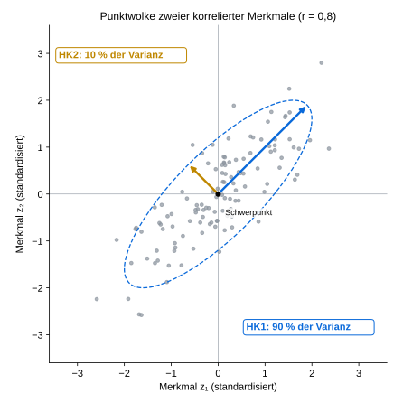
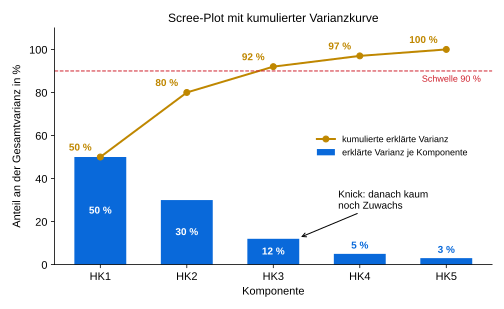
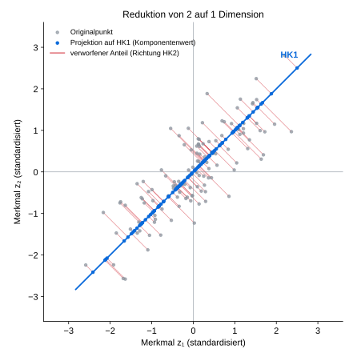
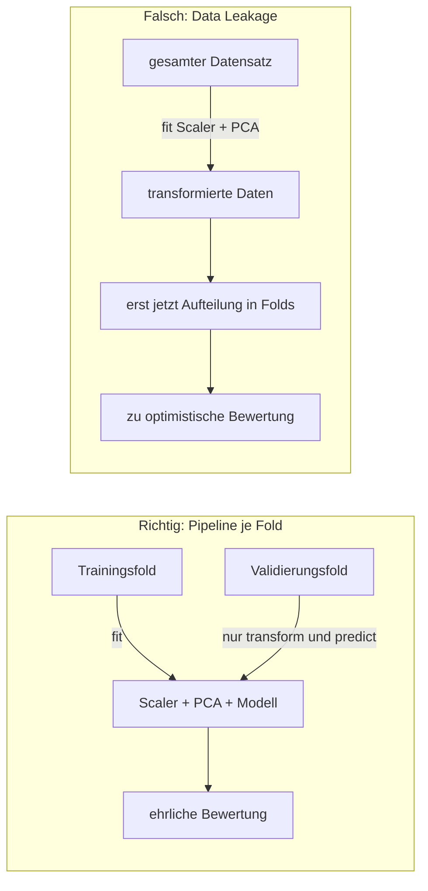

# PCA – Hauptkomponentenanalyse: kompaktes Repetitorium

> **Auf einen Blick**
> PCA (*Principal Component Analysis*) ist ein **unüberwachtes, lineares Verfahren zur Dimensionsreduktion**. Aus vielen numerischen Merkmalen bildet sie wenige neue Merkmale, die **Hauptkomponenten (HK)**. Das sind zueinander senkrechte Achsen, entlang derer die Eingabedaten möglichst stark streuen. Die Zielvariable spielt dabei **keine** Rolle.

**Kennzeichnung der Hinweisboxen:** 📘 Konzept · ⚠️ Prüfungsfalle · 💡 Faustregel

---

## 1. Idee und theoretischer Hintergrund

### 1.1 Das geometrische Bild

Zeichnet man alle Beobachtungen zweier korrelierter Merkmale als Punkte, entsteht eine **längliche Punktwolke**. Um sie lässt sich gedanklich eine Ellipse legen.

- **HK1** verläuft entlang der **längsten Richtung** der Wolke, also entlang der langen Ellipsenachse.
- **HK2** steht **senkrecht** auf HK1 und erfasst die verbleibende Streuung.
- Beide Achsen gehen durch den **Schwerpunkt** der Daten, denn PCA arbeitet mit zentrierten Merkmalen.



*Abb. 1: Zwei standardisierte Merkmale mit Korrelation r = 0,8 (synthetische Daten). HK1 erfasst 90 % der Gesamtvarianz, HK2 die restlichen 10 %.*

Bei drei oder mehr Merkmalen gilt dieselbe Idee im höherdimensionalen Merkmalsraum, sie lässt sich nur schwerer zeichnen. Bei einer **annähernd kreisförmigen** Punktwolke gibt es keine ausgezeichnete „lange Achse“. Dann bringt PCA wenig.

### 1.2 Hauptkomponenten als gewichtete Summen

Jede Hauptkomponente ist eine **gewichtete Linearkombination** der (zentrierten bzw. standardisierten) Ausgangsmerkmale. Ein Datenpunkt erhält seinen **Komponentenwert** durch Projektion auf die Richtung der Komponente.

| Schritt | Formel | Bedeutung |
| --- | --- | --- |
| Standardisieren | z = (x − x̄) / s | Merkmal zentrieren (Mittelwert 0) und auf Standardabweichung 1 bringen |
| Komponentenwert | HK1 = w₁·z₁ + w₂·z₂ + … + wₚ·zₚ | gewichtete Summe aller *p* Merkmale |
| Normierung | w₁² + w₂² + … + wₚ² = 1 | der Gewichtsvektor hat die Länge 1 und beschreibt nur eine **Richtung** |

**Beispiel aus Abb. 1:** HK1 = 0,707 · z₁ + 0,707 · z₂. Die Gewichte sind 1/√2, denn 0,707² + 0,707² = 1. HK1 **kombiniert** beide Merkmale, statt eines auszuwählen. Die tatsächlichen Gewichte lernt PCA aus den Trainingsdaten.

> 📘 **Konzept: Merkmalsextraktion statt Merkmalsauswahl**
> *Feature Selection* behält einige der ursprünglichen Spalten und verwirft die übrigen. PCA betreibt dagegen *Feature Extraction*: Sie bildet **neue** Merkmale, in die alle Ausgangsmerkmale mit bestimmten Gewichten eingehen.

### 1.3 Eigenschaften der Hauptkomponenten

- **Orthogonal:** Die Richtungen stehen paarweise senkrecht aufeinander.
- **Unkorreliert:** Die Komponentenwerte sind auf den Daten, an denen PCA angepasst wurde, unkorreliert.
- **Absteigend geordnet:** HK1 erklärt die größtmögliche Varianz. HK2 erklärt die größtmögliche *zusätzliche* Varianz senkrecht zu HK1, und so weiter.
- **Begrenzte Anzahl:** Es gibt höchstens so viele Komponenten wie Merkmale; bei sehr wenigen Beobachtungen auch entsprechend weniger.
- **Linear:** PCA findet gerade Achsen, keine gekrümmten Strukturen.

> ⚠️ **Prüfungsfalle: Vorzeichen**
> Das Vorzeichen einer Komponente ist beliebig: HK1 und −HK1 beschreiben dieselbe Achse. Unterscheiden sich zwei Läufe oder zwei Programme nur im Vorzeichen der Gewichte, ist das **kein Fehler**.

---

## 2. Erklärte Varianz und Wahl der Komponentenzahl

### 2.1 Begriffe und Formeln

Behält man **alle** Komponenten, bleibt die Gesamtvarianz erhalten. Sie wird nur anders auf die Achsen verteilt:

| Größe | Formel |
| --- | --- |
| Gesamtvarianz | Var(HK1) + Var(HK2) + … + Var(HKp) = Summe der Varianzen aller Merkmale |
| … bei standardisierten Merkmalen | = *p*, denn jedes Merkmal hat die Varianz 1 |
| Erklärte Varianz von HK*k* | Anteil(HK*k*) = Var(HK*k*) / Gesamtvarianz |
| Kumulierte erklärte Varianz | Anteil(HK1) + Anteil(HK2) + … + Anteil(HK*k*) |

Die Prozente beziehen sich auf die Streuung der Eingabedaten **nach der gewählten Vorverarbeitung**. Sie sagen nichts über die Güte eines Vorhersagemodells.

### 2.2 Beispieltabelle

Fünf standardisierte Merkmale, also Gesamtvarianz = 5:

| Komponente | Varianz der Komponente | erklärte Varianz | kumulierte erklärte Varianz |
| --- | ---: | ---: | ---: |
| HK1 | 2,50 | 50 % | 50 % |
| HK2 | 1,50 | 30 % | 80 % |
| HK3 | 0,60 | 12 % | **92 %** |
| HK4 | 0,25 | 5 % | 97 % |
| HK5 | 0,15 | 3 % | 100 % |
| **Summe** | **5,00** | **100 %** | – |

Rechenweg für HK1: 2,50 / 5,00 = 0,50 = 50 %. Mit drei Komponenten wird eine 90-%-Schwelle erstmals überschritten (92 %).

### 2.3 Scree-Plot und kumulative Varianzkurve

Der **Scree-Plot** zeigt die erklärte Varianz *je Komponente* als Balken. Man sucht einen **Knick**, nach dem weitere Komponenten kaum noch etwas beitragen. Die **kumulative Kurve** zeigt, ab welcher Komponentenzahl ein gewünschter Anteil erreicht wird.



*Abb. 2: Scree-Plot (Balken) und kumulierte erklärte Varianz (Linie) für das Beispiel aus 2.2. Knick und 90-%-Schwelle führen hier übereinstimmend zu drei Komponenten.*

> 💡 **Faustregel**
> Ein Schwellenwert wie 90 % und der Knick im Scree-Plot sind **Entscheidungshilfen, keine Qualitätsgarantie**. Beide Kriterien können auch zu unterschiedlichen Empfehlungen führen.

### 2.4 Informationsverlust

Beim Weglassen von Komponenten geht Information verloren: Die Punkte werden auf die behaltenen Achsen projiziert.



*Abb. 3: Reduktion von zwei Merkmalen auf eine Komponente. Jeder Punkt wird durch seinen Komponentenwert auf HK1 ersetzt (blau). Die roten Abstände in Richtung HK2 (hier 10 % der Varianz) gehen verloren.*

- Je weniger Komponenten, desto größer kann der Informationsverlust werden.
- Werden **alle** Komponenten behalten, ist PCA nur ein **Koordinatenwechsel** und reduziert keine Dimension.

> ⚠️ **Prüfungsfalle: hohe erklärte Varianz ≠ hohe Vorhersagegüte**
> PCA maximiert die Varianz der **Eingaben** und kennt die Zielvariable nicht. Eine Richtung mit geringer Varianz kann für Klassifikation oder Regression entscheidend sein. Für Vorhersageaufgaben beurteilt man die Komponentenzahl deshalb zusätzlich mit einer **geeigneten Modellmetrik auf ungesehenen Daten**, zum Beispiel per Kreuzvalidierung. Bei ungleichen Klassenhäufigkeiten ist Accuracy allein oft wenig aussagekräftig.

---

## 3. Wann PCA sinnvoll ist – und welche Grenzen sie hat

**Typische Anwendungen**

| Anwendung | Worauf achten? |
| --- | --- |
| **Verdichten vieler numerischer Merkmale**, besonders stark korrelierter | Nutzt Redundanz zwischen den Spalten; bei kaum korrelierten Merkmalen gibt es wenig zu verdichten. |
| **Vorverarbeitung für ein nachgelagertes Modell** | Kann Rechenaufwand oder Modellverhalten verbessern, muss aber nicht. Immer mit und ohne PCA vergleichen. |
| **Visualisierung** in 2 oder 3 Komponenten | Zeigt nur den erhaltenen Teil der Streuung; scheinbare Trennung oder Überlappung vorsichtig deuten. |

**Grenzen und Abwägungen**

| Grenze | Erläuterung |
| --- | --- |
| **Interpretierbarkeit** | Komponenten mischen viele Ausgangsmerkmale. Die fachliche Bedeutung der neuen Achsen und einzelner Vorhersagen ist schwerer zu erklären. |
| **Kein Zielbezug** | Hohe Eingabevarianz kann für die Vorhersage irrelevant sein. PCA ersetzt weder Modellbewertung noch fachlich begründete Merkmalswahl. |
| **Ausreißer** | Einzelne extreme Beobachtungen können die Hauptachsen stark verdrehen. |
| **Nur linear** | Gekrümmte Strukturen, Gruppen oder seltene Muster bleiben bei der Reduktion nicht zwangsläufig erhalten. |

---

## 4. Praktische Umsetzung: Vorverarbeitung und Training

### 4.1 Ablauf in fünf Schritten

1. **Eingaben festlegen.** PCA braucht numerische Merkmale. Fehlende Werte behandeln, kategoriale Merkmale gegebenenfalls passend kodieren. Die **Zielvariable gehört nicht** zu den PCA-Eingaben.
2. **Daten für die Bewertung trennen.** Die Testmenge wird **vor** dem Anpassen jeder Vorverarbeitung zurückgelegt.
3. **Merkmale skalieren.** PCA bevorzugt Richtungen mit großer Varianz. Ein Merkmal in Pascal würde sonst eines in Kilopascal allein durch seine Einheit dominieren. `StandardScaler` zieht den **Trainings**mittelwert ab und teilt durch die **Trainings**standardabweichung.
4. **PCA am Training anpassen (`fit`), alle Daten transformieren (`transform`).** Mittelwerte, Richtungen und Varianzanteile stammen **ausschließlich** aus den Trainingsdaten. Validierungs-, Test- und Neudaten erhalten dieselbe gelernte Skalierung und Projektion.
5. **Komponentenzahl festlegen und prüfen.** Scree-Plot und kumulierte Varianz beschreiben den Informationsanteil. Ob die Reduktion einer Vorhersage hilft, entscheidet die Leistung der *gesamten* Pipeline. Eine so gewählte Komponentenzahl ist eine Modellentscheidung und gehört ins Auswahlverfahren.

> 📘 **Konzept: Zentrieren vs. Skalieren**
> `sklearn.decomposition.PCA` **zentriert** die Daten selbst, **skaliert** sie aber nicht. Deshalb steht der `StandardScaler` davor. Standardisierung ist keine zwingende mathematische Voraussetzung: Liegen die Merkmale bereits auf vergleichbaren Skalen, kann man fachlich begründet darauf verzichten. Standardisierung ist außerdem selbst empfindlich gegenüber Ausreißern.

### 4.2 Kreuzvalidierung ohne Data Leakage

In **jedem** Durchgang der Kreuzvalidierung werden Skalierer, PCA und Modell **neu und nur auf dem Trainingsfold** angepasst. Der Validierungsfold wird nur transformiert und bewertet.



Schematisch wird die **gesamte Pipeline** `StandardScaler → PCA → Modell` kreuzvalidiert. Nach Auswahl und Bewertung kann man die fertige Pipeline auf den Trainingsdaten erneut anpassen. Die zurückgelegte Testmenge dient der abschließenden, unabhängigen Prüfung.

> ⚠️ **Prüfungsfalle: Zeitreihen**
> Bei zeitlich geordneten Daten (z. B. stündliche Messwerte wie im Datensatz Peking Air Quality) ist eine **zufällige** Aufteilung selbst schon Leakage: Zukünftige Werte gelangen ins Training. Hier muss **chronologisch** geteilt werden, etwa mit `TimeSeriesSplit`. Training liegt dann immer vor der Validierung.

### 4.3 Umsetzung in scikit-learn

```python
from sklearn.pipeline import make_pipeline
from sklearn.preprocessing import StandardScaler
from sklearn.decomposition import PCA
from sklearn.linear_model import LinearRegression
from sklearn.model_selection import TimeSeriesSplit, cross_val_score

# n_components=0.90 → so viele Komponenten, bis mind. 90 % der Varianz erklärt sind
pipe = make_pipeline(StandardScaler(), PCA(n_components=0.90), LinearRegression())

cv = TimeSeriesSplit(n_splits=5)      # chronologisch; bei unabhängigen Beobachtungen: KFold
scores = cross_val_score(pipe, X, y, cv=cv, scoring="neg_mean_absolute_error")

pipe.fit(X_train, y_train)
pca = pipe.named_steps["pca"]
pca.n_components_                        # gewählte Komponentenzahl
pca.explained_variance_ratio_            # erklärte Varianz je Komponente
pca.explained_variance_ratio_.cumsum()   # kumulierte erklärte Varianz
pca.components_                          # Gewichte (eine Zeile je Komponente)
```

---

## 5. Begriffe, die man sicher unterscheiden sollte

| Begriff | Präzise Bedeutung |
| --- | --- |
| Ausgangsmerkmal | Ursprünglich erhobene Eingabevariable. PCA wählt nicht einzelne davon aus, sondern kombiniert sie. |
| Hauptkomponente | Neue Achse (**Richtung**) *oder* Koordinate eines Datenpunkts auf dieser Achse (**Komponentenwert**). Im Zusammenhang auseinanderhalten! |
| Komponenten-Gewichte (auch: *Ladungen*, *Loadings*) | Zahlen, die festlegen, wie stark jedes Ausgangsmerkmal in eine Komponente eingeht. |
| Komponentenwerte (auch: *Scores*) | Die neuen Koordinaten der Datenpunkte nach der Transformation. |
| Erklärte Varianz | Anteil der Eingabevarianz, den eine einzelne Komponente erfasst. |
| Kumulierte erklärte Varianz | Summe der erklärten Anteile der ersten *k* Komponenten. |
| Modellgüte | Auf ungesehenen Daten gemessene Leistung für die eigentliche Aufgabe. Folgt **nicht** aus der erklärten Varianz. |
| Data Leakage | Information aus Validierungs- oder Testdaten fließt in das Training ein, z. B. durch `fit` auf dem gesamten Datensatz. |

---

## 6. Selbstcheck

**Verständnisfragen**

1. Warum spielt die Zielvariable bei der Bestimmung der Hauptkomponenten keine Rolle – und welche Konsequenz hat das?
2. Was passiert, wenn ein Merkmal in Metern und eines in Millimetern ohne Skalierung in die PCA geht?
3. Ein Kollege passt `StandardScaler` und PCA auf dem gesamten Datensatz an und führt danach eine Kreuzvalidierung durch. Was ist das Problem?
4. Worin unterscheidet sich PCA von einer Merkmalsauswahl?

**Rechenaufgabe (ca. 5 Minuten)**

Vier standardisierte Merkmale werden per PCA transformiert. Die Varianzen der Komponenten betragen 2,4 / 1,0 / 0,4 / 0,2.

- a) Wie groß ist die Gesamtvarianz?
- b) Berechnen Sie erklärte und kumulierte erklärte Varianz für alle Komponenten.
- c) Wie viele Komponenten braucht man mindestens für 90 % erklärte Varianz?
- d) Beurteilen Sie die Aussage: „Mit drei Komponenten wird das Modell zu 95 % genau vorhersagen.“

**Lösung**

- a) Gesamtvarianz = 4, denn es gibt 4 standardisierte Merkmale mit je Varianz 1. Probe: 2,4 + 1,0 + 0,4 + 0,2 = 4,0.
- b) Erklärte Varianz 60 % / 25 % / 10 % / 5 %; kumuliert 60 % / 85 % / 95 % / 100 %.
- c) Drei Komponenten (95 % ≥ 90 %); zwei reichen mit 85 % nicht.
- d) Falsch: Die 95 % beschreiben die Streuung der **Eingabedaten**, nicht die Vorhersagegüte. Die muss auf ungesehenen Daten mit einer geeigneten Metrik gemessen werden.

---

> 💡 **Merksatz**
> PCA sucht in den Eingabedaten neue, zueinander senkrechte Achsen mit möglichst viel Streuung. Wie viele Achsen man behält und ob sie einem Vorhersagemodell helfen, entscheidet man anhand des Anwendungsziels und einer sauberen Bewertung ohne Data Leakage.

---

## Ausblick (nicht prüfungsrelevant)

*Nur als Stichworte zum Weiterlesen:*

- *Eigenvektoren und Eigenwerte der Kovarianz- bzw. Korrelationsmatrix: Richtungen und Varianzen der Hauptkomponenten*
- *Kaiser-Kriterium: bei standardisierten Daten nur Komponenten mit Varianz > 1 behalten*
- *Rekonstruktion und Rekonstruktionsfehler (`inverse_transform`)*
- *Singulärwertzerlegung (SVD) als Rechenweg hinter PCA*
