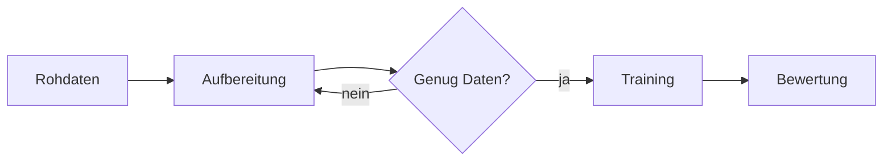
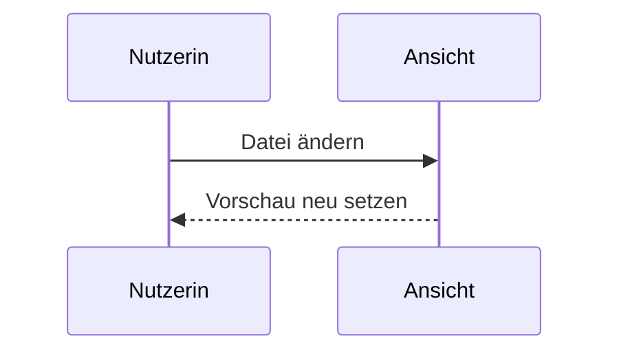

# Glossar: Formatierungsmöglichkeiten

Dieses Glossar beschreibt und zeigt den Auszeichnungsbestand, den die Markdown-Ansicht darstellen kann. Zu jeder Familie steht zuerst der Quelltext, darunter das Ergebnis, wie die App es setzt.

## 1. Frontmatter

Ein Block aus drei Bindestrichen am Dateianfang speist die Kopfzeile des Dokuments. Er wird nicht als Inhalt dargestellt.

```markdown
---
titel: Neuronale Netze — Grundlagen
autor: T. Jörg
datum: 12.05.2026
kurs: ZQ KI und ML
version: 2
---
```

Ausgewertet werden `titel`, `autor`, `datum`, `kurs` und `version`; die englischen Schreibweisen `title`, `author` und `date` gelten ebenso. Ohne `titel` bleibt die Kopfzeile weg. Der Block muss in der allerersten Zeile beginnen.

## 2. Textauszeichnung

```markdown
*Kursiv*, **Fett**, ***Fett-Kursiv***, ~~gestrichen~~ und `Code im Fließtext`.
```

*Kursiv*, **Fett**, ***Fett-Kursiv***, ~~gestrichen~~ und `Code im Fließtext`.

Ein einfacher Zeilenumbruch im Quelltext erzeugt **keinen** Umbruch im Ergebnis — der Text läuft weiter. Einen harten Umbruch erzwingen zwei Leerzeichen am Zeilenende oder ein abschließender Rückstrich `\`. Ein neuer Absatz entsteht durch eine Leerzeile.

Soll ein Sonderzeichen buchstäblich erscheinen, stellen Sie einen Rückstrich voran: `\*kein Kursiv\*` ergibt \*kein Kursiv\*.

## 3. Überschriften

```markdown
# Ebene 1 — Dokumenttitel
## Ebene 2 — Kapitel
### Ebene 3 — Abschnitt
#### Ebene 4 — Unterabschnitt
```

Sechs Ebenen sind möglich; für Lehrmaterial genügen meist drei. Nach der Raute steht ein Leerzeichen. Die Ebenen 1 bis 4 erscheinen in der Gliederung der Seitenleiste und bekommen automatisch eine Sprungmarke (siehe Abschnitt 10).

## 4. Absätze, Linien und Trennung

Eine waagerechte Linie trennt Abschnitte:

```markdown
---
```

Sie steht allein in einer Zeile und braucht davor eine Leerzeile — sonst liest die App die Zeile davor als Überschrift.

## 5. Listen

```markdown
* Erster Punkt
* Zweiter Punkt
  * Unterpunkt (zwei Leerzeichen eingerückt)

1. Erster Schritt
2. Zweiter Schritt
   1. Teilschritt (drei Leerzeichen eingerückt)
```

* Erster Punkt
* Zweiter Punkt
  * Unterpunkt (zwei Leerzeichen eingerückt)

1. Erster Schritt
2. Zweiter Schritt
   1. Teilschritt (drei Leerzeichen eingerückt)

Statt `*` gehen auch `-` und `+`. Bei geordneten Listen zählt nur die erste Zahl; alle weiteren dürfen `1.` lauten.

## 6. Aufgabenlisten

```markdown
- [x] Erledigter Punkt
- [ ] Offener Punkt
```

- [x] Erledigter Punkt
- [ ] Offener Punkt

Die Klammer steht unmittelbar am Anfang des Listenpunkts, gefolgt von einem Leerzeichen. Die Kästchen sind eine Darstellung, kein Bedienelement — sie lassen sich in der Ansicht nicht anklicken.

## 7. Blockzitate

```markdown
> Wer Wissen weitergibt, muss es zweimal durchdringen:
> einmal für sich und einmal für die Lernenden.
```

> Wer Wissen weitergibt, muss es zweimal durchdringen:
> einmal für sich und einmal für die Lernenden.

## 8. Hinweisboxen

Für hervorgehobene Kästen gibt es zwei gleichwertige Schreibweisen. Die erste hängt sich an das Blockzitat:

```markdown
> [!TIPP] Eigener Titel
> Der Titel hinter der Klammer ist freiwillig.
> Ohne ihn steht die Bezeichnung des Typs im Kopf.
```

> [!TIPP] Eigener Titel
> Der Titel hinter der Klammer ist freiwillig.
> Ohne ihn steht die Bezeichnung des Typs im Kopf.

Die zweite umschließt den Inhalt mit drei Doppelpunkten und trägt beliebige Blockelemente:

```markdown
:::warnung Häufiger Irrtum
Der Lernvorgang endet **nicht**, wenn der Fehler auf den Trainingsdaten null wird.

* Overfitting bleibt unbemerkt
* deshalb immer gegen die Validierungsdaten prüfen
:::
```

:::warnung Häufiger Irrtum
Der Lernvorgang endet **nicht**, wenn der Fehler auf den Trainingsdaten null wird.

* Overfitting bleibt unbemerkt
* deshalb immer gegen die Validierungsdaten prüfen
:::

Verfügbare Typen und ihre Kopfzeile:

| Typ | Kopf | Typ | Kopf |
| --- | --- | --- | --- |
| `hinweis` / `note` | Hinweis | `tipp` / `tip` | Tipp |
| `konzept` | Konzept | `faustregel` | Faustregel |
| `warnung` / `warning` | Achtung | `prompt` | Prompt |
| `caution` | Vorsicht | `tool` | Werkzeug |
| `merke` | Merke | `important` | Wichtig |

Die Typbezeichnung ist unempfindlich gegen Groß- und Kleinschreibung: `> [!TIPP]`, `> [!Tipp]` und `:::tipp` führen zum selben Kasten. Die abschließende `:::`-Zeile darf nicht vergessen werden — fehlt sie, läuft der Kasten bis zum Dateiende.

## 9. Tabellen

```markdown
| Verfahren | Aufwand | Eignung |
|:--------- |:-------:| -------:|
| k-NN | gering | kleine Datensätze |
| Random Forest | mittel | gemischte Merkmale |
```

| Verfahren | Aufwand | Eignung |
|:--------- |:-------:| -------:|
| k-NN | gering | kleine Datensätze |
| Random Forest | mittel | gemischte Merkmale |

Der Doppelpunkt in der Trennzeile steuert die Ausrichtung: links, mittig, rechts. Die Striche müssen nicht ausgerichtet sein, das erleichtert nur das Lesen im Quelltext. Breite Tabellen lassen sich in der Ansicht seitlich rollen.

## 10. Verweise

Drei Arten von Verweisen verhalten sich unterschiedlich — die Unterscheidung ist wichtig, weil nur die erste Art die App verlässt.

### 10.1 Nach außen: Webseiten und Adressen

```markdown
[iludis](https://iludis.de) · <https://iludis.de> · [Mail](mailto:info@example.com)
```

Diese Verweise öffnen sich in einem neuen Tab; die Ansicht bleibt erhalten. Eine nackt geschriebene Adresse wie https://iludis.de wird automatisch erkannt, die spitzen Klammern sind also nur zur Verdeutlichung nötig.

### 10.2 Auf andere Dateien des Ordners

```markdown
[Zum Arbeitsblatt](arbeitsblatt.md)
[Kapitel im Unterordner](kapitel/02-perzeptron.md)
[Eine Ebene höher](../uebersicht.md)
```

Verweise auf `.md`-Dateien öffnen das Ziel **innerhalb** der App, wenn der Ordner geöffnet ist (nicht nur die Einzeldatei). Der Pfad ist relativ zur verweisenden Datei. Ist das Ziel nicht auffindbar, erscheint der Verweis rot punktiert und meldet beim Anklicken den gesuchten Pfad — ein brauchbarer Test für die Vollständigkeit eines Materialsatzes.

Verweise auf andere Dateiarten (PDF, ZIP, Bilder als Ziel) lassen sich in der Ansicht nicht öffnen; sie werden ebenfalls kenntlich gemacht, damit der Browser nicht aus der App herausnavigiert.

### 10.3 Innerhalb desselben Dokuments

```markdown
Siehe [Abschnitt zu Formeln](#13-formeln-katex).
```

Sprungmarken zeigen mit einer Raute auf die Marke einer Überschrift. Die App vergibt diese Marken selbst, nach festen Regeln:

* alles klein geschrieben
* `ä ö ü ß` werden zu `ae oe ue ss`
* Leerzeichen werden zu Bindestrichen
* alle übrigen Sonderzeichen entfallen, Ziffern und Bindestriche bleiben
* höchstens 60 Zeichen; kommt derselbe Text mehrfach vor, hängt die App `-2`, `-3` an
* vergeben werden Marken nur für die Ebenen 1 bis 4

Aus `## 13. Formeln (KaTeX)` wird damit `#13-formeln-katex`. Eine eigene Marke lässt sich mit einer HTML-Auszeichnung setzen: `<h2 id="eigene-marke">Titel</h2>`.

### 10.4 Verweise mit Fußzeilen-Schreibweise

Bei mehrfach benutzten Zielen lohnt die getrennte Schreibweise:

```markdown
Der [Rahmenplan][rp] und die [Handreichung][hr] gehören zusammen.

[rp]: https://example.com/rahmenplan
[hr]: https://example.com/handreichung "Titel beim Überfahren"
```

Die Definitionszeilen erscheinen nicht im Ergebnis und dürfen am Dateiende stehen.

## 11. Abbildungen

```markdown


```

Das Ausrufezeichen macht aus dem Verweis eine Abbildung. Der Pfad ist relativ zur Datei; **relative Bilder lassen sich nur auflösen, wenn ein Ordner geöffnet ist**, nicht bei einer geöffneten Einzeldatei.

Steht ein Bild allein in seinem Absatz, setzt die App daraus eine nummerierte Abbildung: Der Titel in Anführungszeichen — ersatzweise der Alternativtext — wird zur Beschriftung „Abb. 1: …". Ein Bild mitten im Fließtext bleibt ein einfaches Bild ohne Beschriftung.

## 12. Code

Code im Fließtext steht zwischen einfachen Backticks: `pip install scikit-learn`.

Ganze Blöcke stehen zwischen drei Backticks, mit der Sprache unmittelbar hinter der öffnenden Zeile:

````markdown
```python
def sigmoid(x):
    return 1 / (1 + math.exp(-x))
```
````

```python
def sigmoid(x):
    return 1 / (1 + math.exp(-x))
```

Die Sprachangabe steuert die Einfärbung und erscheint als Marke am Blockrand. Gebräuchlich sind unter anderem `python`, `javascript`, `java`, `sql`, `bash`, `json`, `yaml`, `html`, `css`, `csharp`, `cpp`, `markdown`. Ohne Angabe bleibt der Block ungefärbt — das ist für Ausgaben und Protokolle oft die bessere Wahl.

Innerhalb eines Codeblocks wird nichts weiter ausgewertet: keine Formeln, keine Boxen, keine Verweise. Soll ein Block seinerseits drei Backticks zeigen, umschließen Sie ihn mit vieren.

## 13. Formeln (KaTeX)

Formeln werden mit KaTeX gesetzt. Es gibt zwei Betriebsarten:

| Art | Schreibweise | Wirkung |
| --- | --- | --- |
| im Fließtext | `$ ... $` oder `\( ... \)` | die Formel steht in der Zeile |
| abgesetzt | `$$ ... $$` oder `\[ ... \]` | eigene Zeile, zentriert, größere Zeichen |

Die Fläche eines Neurons lautet $y = \sigma(\mathbf{w}^\top \mathbf{x} + b)$ — abgesetzt geschrieben:

$$y = \sigma\left(\sum_{i=1}^{n} w_i x_i + b\right)$$

### 13.1 Bausteine

| Zweck | Eingabe | Ergebnis |
| --- | --- | --- |
| Bruch | `\frac{a}{b}` | $\frac{a}{b}$ |
| Potenz, Index | `x^{2}`, `x_{i}`, `x_{i}^{2}` | $x_{i}^{2}$ |
| Wurzel | `\sqrt{x}`, `\sqrt[3]{x}` | $\sqrt[3]{x}$ |
| Summe, Produkt | `\sum_{i=1}^{n}`, `\prod_{i=1}^{n}` | $\sum_{i=1}^{n}$ |
| Integral | `\int_{a}^{b} f(x)\,dx` | $\int_{a}^{b} f(x)\,dx$ |
| Grenzwert | `\lim_{x \to 0}` | $\lim_{x \to 0}$ |
| Ableitung | `\frac{\partial L}{\partial w}` | $\frac{\partial L}{\partial w}$ |
| Vektor, Matrix | `\vec{v}`, `\mathbf{W}` | $\vec{v},\ \mathbf{W}$ |
| Mengen, Relationen | `\in \subset \leq \geq \neq \approx` | $\in\ \subset\ \leq\ \geq\ \neq\ \approx$ |
| Pfeile | `\to \Rightarrow \mapsto` | $\to\ \Rightarrow\ \mapsto$ |
| Griechisch | `\alpha \beta \eta \sigma \Delta \Omega` | $\alpha\ \beta\ \eta\ \sigma\ \Delta\ \Omega$ |
| Funktionsnamen | `\sin \cos \log \exp \max` | $\sin\ \cos\ \log\ \exp\ \max$ |
| eigener Name | `\operatorname{softmax}` | $\operatorname{softmax}$ |
| Wörter in Formeln | `\text{Fehler}` | $\text{Fehler}$ |
| Klammern mitwachsend | `\left( ... \right)` | $\left(\frac{a}{b}\right)$ |
| schmaler Abstand | `\,` `\;` `\quad` | — |

Zeichen wie `\sin` oder `\max` sollten stets mit Rückstrich geschrieben werden: Nur dann setzt KaTeX sie aufrecht statt kursiv und hält den Abstand zum Argument.

### 13.2 Mehrzeilige Formeln

Mehrere Zeilen werden mit `\\` getrennt und mit `&` an einer Stelle ausgerichtet:

```latex
$$
\begin{aligned}
L(w) &= \frac{1}{n} \sum_{i=1}^{n} (y_i - \hat{y}_i)^2 \\
     &= \frac{1}{n} \lVert \mathbf{y} - \mathbf{X}\mathbf{w} \rVert^2
\end{aligned}
$$
```

$$
\begin{aligned}
L(w) &= \frac{1}{n} \sum_{i=1}^{n} (y_i - \hat{y}_i)^2 \\
     &= \frac{1}{n} \lVert \mathbf{y} - \mathbf{X}\mathbf{w} \rVert^2
\end{aligned}
$$

Weitere gebräuchliche Umgebungen sind `pmatrix` und `bmatrix` für Matrizen sowie `cases` für Fallunterscheidungen:

$$
\mathbf{W} = \begin{pmatrix} w_{11} & w_{12} \\ w_{21} & w_{22} \end{pmatrix}
\qquad
\text{ReLU}(x) = \begin{cases} x & \text{für } x > 0 \\ 0 & \text{sonst} \end{cases}
$$

### 13.3 Fallstricke

* Ein Dollarzeichen, das kein Formelanfang sein soll, wird mit `\$` geschrieben — sonst sucht KaTeX bis zum nächsten `$` und formt alles dazwischen um.
* In Codeblöcken und Code im Fließtext wird **nicht** gerechnet; dort steht `$x$` buchstäblich.
* Eine fehlerhafte Formel bricht die Seite nicht ab, sondern erscheint rot an ihrer Stelle — der Fehler ist also sofort sichtbar.
* KaTeX ist kein vollständiges LaTeX: `\label`, `\ref`, `figure`- oder `table`-Umgebungen gibt es nicht. Eigene Kürzel mit `\newcommand` wirken nur innerhalb derselben Formel, nicht dokumentweit.
* Ohne Netzverbindung braucht der Formelsatz die mitgelieferten KaTeX-Dateien im Ordner `vendor`; fehlen sie, bleibt die Formel als Quelltext stehen.

## 14. Mermaid-Diagramme

Ein Codeblock mit der Sprachangabe `mermaid` wird als Diagramm gezeichnet. Quelltext:

    ```mermaid
    flowchart LR
      A[Rohdaten] --> B[Aufbereitung]
      B --> C{Genug Daten?}
      C -- ja --> D[Training]
      C -- nein --> B
      D --> E[Bewertung]
    ```

Ergebnis:



Neben `flowchart` stehen unter anderem `sequenceDiagram`, `classDiagram`, `stateDiagram-v2`, `erDiagram`, `gantt`, `pie` und `mindmap` zur Verfügung:



Diagramme folgen dem gewählten Stil: Im Beamer-Stil zeichnet Mermaid dunkel. Scheitert das Zeichnen, zeigt die App den Quelltext des Diagramms an der betreffenden Stelle — so bleibt der Inhalt lesbar.

## 15. Fußnoten

```markdown
Der Begriff geht auf Rosenblatt zurück[^perzeptron].

[^perzeptron]: F. Rosenblatt, 1958. Die Definitionszeile darf am Dateiende stehen.
```

Der Begriff geht auf Rosenblatt zurück[^perzeptron].

[^perzeptron]: F. Rosenblatt, 1958. Die Definitionszeile darf am Dateiende stehen.

Die Fußnoten sammeln sich am Ende des Dokuments; der Rückverweis führt an die Fundstelle zurück. Als Kürzel taugt jede Zeichenfolge ohne Leerzeichen, die Nummerierung übernimmt die App.

## 16. Eingebettetes HTML

Wo Markdown nicht ausreicht, ist HTML unmittelbar erlaubt — etwa für eine eigene Sprungmarke, eine Zelle über zwei Spalten oder gezielte Abstände:

```markdown
<h3 id="eigene-marke">Überschrift mit eigener Marke</h3>
Text mit <abbr title="Deutscher Qualifikationsrahmen">DQR</abbr>-Abkürzung.
```

Sparsam einsetzen: HTML macht ein Dokument schwerer wartbar, und beim Sichern als HTML-Datei wandert es unverändert mit.

## 17. Was die Ansicht nicht kennt

Diese aus anderen Werkzeugen vertrauten Schreibweisen bleiben wirkungslos und erscheinen als roher Text:

* `==Markierung==` (Hervorhebung mit Gleichheitszeichen)
* `[[Wiki-Verweise]]` in doppelten eckigen Klammern
* Emoji-Kürzel wie `:smile:`
* Definitionslisten (`Begriff` / `: Erklärung`)
* automatische Inhaltsverzeichnisse per `[TOC]` — die Gliederung der Seitenleiste übernimmt diese Aufgabe
